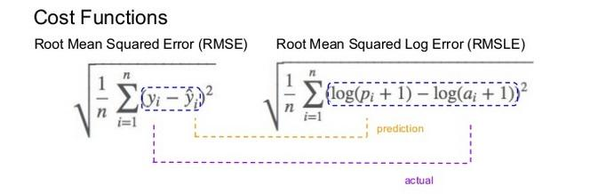
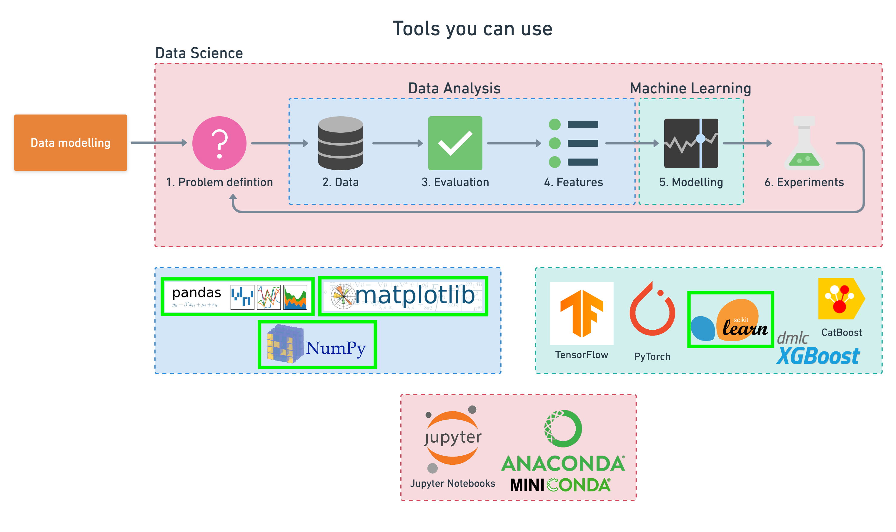

# ML-Sale-Price-of-Bulldozers-regression-
# 🚜 Predicting the Sale Price of Bulldozers using Machine Learning 

-  `predicting the sale price of bulldozers`.
- Predict the auction sale price for a piece of heavy equipment to create a "blue book" for bulldozers.
- you are predicting the sale price of bulldozers sold at auctions.

- Since we're trying to predict a number, this kind of problem is known as a **regression problem**.

- The data and evaluation metric we'll be using (root mean square log error or RMSLE) is from the [Kaggle Bluebook for Bulldozers competition](https://www.kaggle.com/c/bluebook-for-bulldozers/overview).

- The techniques used in here have been inspired and adapted from [the fast.ai machine learning course](https://course18.fast.ai/ml).

## Root Mean Squared Logaritmic Error (RMSLE)
It is the Root Mean Squared Error of the `log-transformed` predicted and `log-transformed` actual values. `RMSLE` adds 1 to both actual and predicted values before taking the `natural logarithm` to avoid taking the natural log of possible 0 (zero) values.
|  |

## What we'll end up with

Since we already have a dataset, we'll approach the problem with the following machine learning modelling framework.

|  | 
|:--:| 
| 6 Step Machine Learning Modelling Framework ([read more](https://whimsical.com/9g65jgoRYTxMXxDosndYTB)) |

### 6 Step Machine Learning Modelling Framework
#### 1. Problem Definition:
- Is is Supervised or Unsupervised Learning?
- Classification or Regression?
 
#### 2. Data
- Is your Data Static? or I it streaming?
    - static: Is it structured (Rows and columns) or Unstructured (pictures, audio, files, videos)

#### 3. Evaluation 
- How are you going to measure whether or not your project was a success?

#### 4. Features
- You have got all the Data, but Is it all of the same quality?
- Use features which have a wide spread across samples. 

#### 5. Modeling 
- Different models work best on different Data.
- `For structured Data`: Use random Forests or Enesembles of Gradient Boosted Decision Trees like XGBoost and CatBoost.
- `For Unstructured Data`: Use Neural Networks, or Deep Learning and Transfer Learning. 

#### 6. Experiments
- Since Machine Learniong is highly iterative, how can what you've found influence what you can find next time?

<br>

To work through these topics, we'll use `pandas`, `Matplotlib` and `NumPy` for **data anaylsis**, as well as, `Scikit-Learn` for **machine learning and modelling tasks**.

|  | 
|:--:| 
| Tools which can be used for each step of the machine learning modelling process. |

|  | 


We'll work through each step and by the end of the notebook, we'll have a trained machine learning model which predicts the sale price of a bulldozer given different characteristics about it.


```python

```

## 1. Problem Definition

For this dataset, the problem we're trying to solve, or better, the question we're trying to answer is,

> How well can we predict `the future sale price of a bulldozer`, given its characteristics previous examples of how much similar bulldozers have been sold for?

## 2. Data

Looking at the [dataset from Kaggle](https://www.kaggle.com/c/bluebook-for-bulldozers/data), you can see it's a **time series problem**. This means there's a time attribute to dataset.

In this case, it's historical sales data of bulldozers. Including things like, model type, size, sale date and more.

There are 3 datasets:
1. **Train.csv** - Historical bulldozer sales examples up to 2011 (close to 400,000 examples with 50+ different attributes, including `SalePrice` which is the **target variable**).
2. **Valid.csv** - Historical bulldozer sales examples from January 1 2012 to April 30 2012 (close to 12,000 examples with the same attributes as **Train.csv**).
3. **Test.csv** - Historical bulldozer sales examples from May 1 2012 to November 2012 (close to 12,000 examples but missing the `SalePrice` attribute, as this is what we'll be trying to predict).

## 3. Evaluation

For this problem, [Kaggle has set the evaluation metric to being root mean squared log error (RMSLE)](https://www.kaggle.com/c/bluebook-for-bulldozers/overview/evaluation). 
- As with many regression evaluations, the goal will be to get this value **as low as possible**.

To see how well our model is doing, we'll calculate the RMSLE and then compare our results to others on the [Kaggle leaderboard](https://www.kaggle.com/c/bluebook-for-bulldozers/leaderboard).

## 4. Features

Features are different parts of the data. During this step, you'll want to start finding out what you can know about the data.

One of the most common ways to do this, is to create a **data dictionary**.

For this dataset, Kaggle provide a data dictionary which contains information about what each attribute of the dataset means. You can [download this file directly from the Kaggle competition page](https://www.kaggle.com/c/bluebook-for-bulldozers/download/Bnl6RAHA0enbg0UfAvGA%2Fversions%2FwBG4f35Q8mAbfkzwCeZn%2Ffiles%2FData%20Dictionary.xlsx) (account required) or view it on Google Sheets.

With all of this being known, let's get started! 

First, we'll import the dataset and start exploring. Since we know the evaluation metric we're trying to minimise, our first goal will be building a baseline model and seeing how it stacks up against the competition.

### Importing the data and preparing it for modelling


```python
# Import data analysis tools 
import pandas as pd
import numpy as np
import matplotlib.pyplot as plt
```

Now we've got our tools for data analysis ready, we can import the data and start to explore it.

For this project, we've [downloaded the data from Kaggle](https://www.kaggle.com/c/bluebook-for-bulldozers/data) and stored it under the file path `"../data/"`.


```python
# Import the training and validation set
df = pd.read_csv("data/TrainAndValid.csv")
```

    /var/folders/mv/w92z5zyj597_v78x144sr4j00000gn/T/ipykernel_1925/722864445.py:2: DtypeWarning: Columns (13,39,40,41) have mixed types. Specify dtype option on import or set low_memory=False.
      df = pd.read_csv("data/TrainAndValid.csv")


```python
# No parse_dates... check dtype of "saledate"
df.info()
```

    <class 'pandas.core.frame.DataFrame'>
    RangeIndex: 412698 entries, 0 to 412697
    Data columns (total 53 columns):
     #   Column                    Non-Null Count   Dtype  
    ---  ------                    --------------   -----  
     0   SalesID                   412698 non-null  int64  
     1   SalePrice                 412698 non-null  float64
     2   MachineID                 412698 non-null  int64  
     3   ModelID                   412698 non-null  int64  
     4   datasource                412698 non-null  int64  
     5   auctioneerID              392562 non-null  float64
     6   YearMade                  412698 non-null  int64  
     7   MachineHoursCurrentMeter  147504 non-null  float64
     8   UsageBand                 73670 non-null   object 
     9   saledate                  412698 non-null  object 
     10  fiModelDesc               412698 non-null  object 
     11  fiBaseModel               412698 non-null  object 
     12  fiSecondaryDesc           271971 non-null  object 
     13  fiModelSeries             58667 non-null   object 
     14  fiModelDescriptor         74816 non-null   object 
     15  ProductSize               196093 non-null  object 
     16  fiProductClassDesc        412698 non-null  object 
     17  state                     412698 non-null  object 
     18  ProductGroup              412698 non-null  object 
     19  ProductGroupDesc          412698 non-null  object 
     20  Drive_System              107087 non-null  object 
     21  Enclosure                 412364 non-null  object 
     22  Forks                     197715 non-null  object 
     23  Pad_Type                  81096 non-null   object 
     24  Ride_Control              152728 non-null  object 
     25  Stick                     81096 non-null   object 
     26  Transmission              188007 non-null  object 
     27  Turbocharged              81096 non-null   object 
     28  Blade_Extension           25983 non-null   object 
     29  Blade_Width               25983 non-null   object 
     30  Enclosure_Type            25983 non-null   object 
     31  Engine_Horsepower         25983 non-null   object 
     32  Hydraulics                330133 non-null  object 
     33  Pushblock                 25983 non-null   object 
     34  Ripper                    106945 non-null  object 
     35  Scarifier                 25994 non-null   object 
     36  Tip_Control               25983 non-null   object 
     37  Tire_Size                 97638 non-null   object 
     38  Coupler                   220679 non-null  object 
     39  Coupler_System            44974 non-null   object 
     40  Grouser_Tracks            44875 non-null   object 
     41  Hydraulics_Flow           44875 non-null   object 
     42  Track_Type                102193 non-null  object 
     43  Undercarriage_Pad_Width   102916 non-null  object 
     44  Stick_Length              102261 non-null  object 
     45  Thumb                     102332 non-null  object 
     46  Pattern_Changer           102261 non-null  object 
     47  Grouser_Type              102193 non-null  object 
     48  Backhoe_Mounting          80712 non-null   object 
     49  Blade_Type                81875 non-null   object 
     50  Travel_Controls           81877 non-null   object 
     51  Differential_Type         71564 non-null   object 
     52  Steering_Controls         71522 non-null   object 
    dtypes: float64(3), int64(5), object(45)
    memory usage: 166.9+ MB


```python
fig, ax = plt.subplots()
ax.scatter(df["saledate"][:1000], df["SalePrice"][:1000])
```


    <matplotlib.collections.PathCollection at 0x7fdc03cec2e0>


    

    


```python
df.SalePrice.plot.hist()
```


    <AxesSubplot:ylabel='Frequency'>


    

    


### Parsing dates
When working with time series data, it's a good idea to make sure any date data is the format of a [datetime object](https://docs.python.org/3/library/datetime.html) (a Python data type which encodes specific information about dates).


```python
df = pd.read_csv("data/TrainAndValid.csv",
                 low_memory=False,
                 parse_dates=["saledate"])
```

- If low_memory=False , then whole columns will be read in first, and then the proper types determined. For example, the column will be kept as objects (strings) as needed to preserve information. If low_memory=True (the default), then pandas reads in the data in chunks of rows, then appends them together.


```python
# With parse_dates... check dtype of "saledate"
df.info()
```

    <class 'pandas.core.frame.DataFrame'>
    RangeIndex: 412698 entries, 0 to 412697
    Data columns (total 53 columns):
     #   Column                    Non-Null Count   Dtype         
    ---  ------                    --------------   -----         
     0   SalesID                   412698 non-null  int64         
     1   SalePrice                 412698 non-null  float64       
     2   MachineID                 412698 non-null  int64         
     3   ModelID                   412698 non-null  int64         
     4   datasource                412698 non-null  int64         
     5   auctioneerID              392562 non-null  float64       
     6   YearMade                  412698 non-null  int64         
     7   MachineHoursCurrentMeter  147504 non-null  float64       
     8   UsageBand                 73670 non-null   object        
     9   saledate                  412698 non-null  datetime64[ns]
     10  fiModelDesc               412698 non-null  object        
     11  fiBaseModel               412698 non-null  object        
     12  fiSecondaryDesc           271971 non-null  object        
     13  fiModelSeries             58667 non-null   object        
     14  fiModelDescriptor         74816 non-null   object        
     15  ProductSize               196093 non-null  object        
     16  fiProductClassDesc        412698 non-null  object        
     17  state                     412698 non-null  object        
     18  ProductGroup              412698 non-null  object        
     19  ProductGroupDesc          412698 non-null  object        
     20  Drive_System              107087 non-null  object        
     21  Enclosure                 412364 non-null  object        
     22  Forks                     197715 non-null  object        
     23  Pad_Type                  81096 non-null   object        
     24  Ride_Control              152728 non-null  object        
     25  Stick                     81096 non-null   object        
     26  Transmission              188007 non-null  object        
     27  Turbocharged              81096 non-null   object        
     28  Blade_Extension           25983 non-null   object        
     29  Blade_Width               25983 non-null   object        
     30  Enclosure_Type            25983 non-null   object        
     31  Engine_Horsepower         25983 non-null   object        
     32  Hydraulics                330133 non-null  object        
     33  Pushblock                 25983 non-null   object        
     34  Ripper                    106945 non-null  object        
     35  Scarifier                 25994 non-null   object        
     36  Tip_Control               25983 non-null   object        
     37  Tire_Size                 97638 non-null   object        
     38  Coupler                   220679 non-null  object        
     39  Coupler_System            44974 non-null   object        
     40  Grouser_Tracks            44875 non-null   object        
     41  Hydraulics_Flow           44875 non-null   object        
     42  Track_Type                102193 non-null  object        
     43  Undercarriage_Pad_Width   102916 non-null  object        
     44  Stick_Length              102261 non-null  object        
     45  Thumb                     102332 non-null  object        
     46  Pattern_Changer           102261 non-null  object        
     47  Grouser_Type              102193 non-null  object        
     48  Backhoe_Mounting          80712 non-null   object        
     49  Blade_Type                81875 non-null   object        
     50  Travel_Controls           81877 non-null   object        
     51  Differential_Type         71564 non-null   object        
     52  Steering_Controls         71522 non-null   object        
    dtypes: datetime64[ns](1), float64(3), int64(5), object(44)
    memory usage: 166.9+ MB


```python
fig, ax = plt.subplots()
ax.scatter(df["saledate"][:1000], df["SalePrice"][:1000])
```


    <matplotlib.collections.PathCollection at 0x7fdc24f008e0>


    

    


```python
df.head()
```


<div>
<style scoped>
    .dataframe tbody tr th:only-of-type {
        vertical-align: middle;
    }

    .dataframe tbody tr th {
        vertical-align: top;
    }

    .dataframe thead th {
        text-align: right;
    }
</style>
<table border="1" class="dataframe">
  <thead>
    <tr style="text-align: right;">
      <th></th>
      <th>SalesID</th>
      <th>SalePrice</th>
      <th>MachineID</th>
      <th>ModelID</th>
      <th>datasource</th>
      <th>auctioneerID</th>
      <th>YearMade</th>
      <th>MachineHoursCurrentMeter</th>
      <th>UsageBand</th>
      <th>saledate</th>
      <th>...</th>
      <th>Undercarriage_Pad_Width</th>
      <th>Stick_Length</th>
      <th>Thumb</th>
      <th>Pattern_Changer</th>
      <th>Grouser_Type</th>
      <th>Backhoe_Mounting</th>
      <th>Blade_Type</th>
      <th>Travel_Controls</th>
      <th>Differential_Type</th>
      <th>Steering_Controls</th>
    </tr>
  </thead>
  <tbody>
    <tr>
      <th>0</th>
      <td>1139246</td>
      <td>66000.0</td>
      <td>999089</td>
      <td>3157</td>
      <td>121</td>
      <td>3.0</td>
      <td>2004</td>
      <td>68.0</td>
      <td>Low</td>
      <td>2006-11-16</td>
      <td>...</td>
      <td>NaN</td>
      <td>NaN</td>
      <td>NaN</td>
      <td>NaN</td>
      <td>NaN</td>
      <td>NaN</td>
      <td>NaN</td>
      <td>NaN</td>
      <td>Standard</td>
      <td>Conventional</td>
    </tr>
    <tr>
      <th>1</th>
      <td>1139248</td>
      <td>57000.0</td>
      <td>117657</td>
      <td>77</td>
      <td>121</td>
      <td>3.0</td>
      <td>1996</td>
      <td>4640.0</td>
      <td>Low</td>
      <td>2004-03-26</td>
      <td>...</td>
      <td>NaN</td>
      <td>NaN</td>
      <td>NaN</td>
      <td>NaN</td>
      <td>NaN</td>
      <td>NaN</td>
      <td>NaN</td>
      <td>NaN</td>
      <td>Standard</td>
      <td>Conventional</td>
    </tr>
    <tr>
      <th>2</th>
      <td>1139249</td>
      <td>10000.0</td>
      <td>434808</td>
      <td>7009</td>
      <td>121</td>
      <td>3.0</td>
      <td>2001</td>
      <td>2838.0</td>
      <td>High</td>
      <td>2004-02-26</td>
      <td>...</td>
      <td>NaN</td>
      <td>NaN</td>
      <td>NaN</td>
      <td>NaN</td>
      <td>NaN</td>
      <td>NaN</td>
      <td>NaN</td>
      <td>NaN</td>
      <td>NaN</td>
      <td>NaN</td>
    </tr>
    <tr>
      <th>3</th>
      <td>1139251</td>
      <td>38500.0</td>
      <td>1026470</td>
      <td>332</td>
      <td>121</td>
      <td>3.0</td>
      <td>2001</td>
      <td>3486.0</td>
      <td>High</td>
      <td>2011-05-19</td>
      <td>...</td>
      <td>NaN</td>
      <td>NaN</td>
      <td>NaN</td>
      <td>NaN</td>
      <td>NaN</td>
      <td>NaN</td>
      <td>NaN</td>
      <td>NaN</td>
      <td>NaN</td>
      <td>NaN</td>
    </tr>
    <tr>
      <th>4</th>
      <td>1139253</td>
      <td>11000.0</td>
      <td>1057373</td>
      <td>17311</td>
      <td>121</td>
      <td>3.0</td>
      <td>2007</td>
      <td>722.0</td>
      <td>Medium</td>
      <td>2009-07-23</td>
      <td>...</td>
      <td>NaN</td>
      <td>NaN</td>
      <td>NaN</td>
      <td>NaN</td>
      <td>NaN</td>
      <td>NaN</td>
      <td>NaN</td>
      <td>NaN</td>
      <td>NaN</td>
      <td>NaN</td>
    </tr>
  </tbody>
</table>
<p>5 rows × 53 columns</p>
</div>


```python
df.head().T
```


<div>
<style scoped>
    .dataframe tbody tr th:only-of-type {
        vertical-align: middle;
    }

    .dataframe tbody tr th {
        vertical-align: top;
    }

    .dataframe thead th {
        text-align: right;
    }
</style>
<table border="1" class="dataframe">
  <thead>
    <tr style="text-align: right;">
      <th></th>
      <th>0</th>
      <th>1</th>
      <th>2</th>
      <th>3</th>
      <th>4</th>
    </tr>
  </thead>
  <tbody>
    <tr>
      <th>SalesID</th>
      <td>1139246</td>
      <td>1139248</td>
      <td>1139249</td>
      <td>1139251</td>
      <td>1139253</td>
    </tr>
    <tr>
      <th>SalePrice</th>
      <td>66000.0</td>
      <td>57000.0</td>
      <td>10000.0</td>
      <td>38500.0</td>
      <td>11000.0</td>
    </tr>
    <tr>
      <th>MachineID</th>
      <td>999089</td>
      <td>117657</td>
      <td>434808</td>
      <td>1026470</td>
      <td>1057373</td>
    </tr>
    <tr>
      <th>ModelID</th>
      <td>3157</td>
      <td>77</td>
      <td>7009</td>
      <td>332</td>
      <td>17311</td>
    </tr>
    <tr>
      <th>datasource</th>
      <td>121</td>
      <td>121</td>
      <td>121</td>
      <td>121</td>
      <td>121</td>
    </tr>
    <tr>
      <th>auctioneerID</th>
      <td>3.0</td>
      <td>3.0</td>
      <td>3.0</td>
      <td>3.0</td>
      <td>3.0</td>
    </tr>
    <tr>
      <th>YearMade</th>
      <td>2004</td>
      <td>1996</td>
      <td>2001</td>
      <td>2001</td>
      <td>2007</td>
    </tr>
    <tr>
      <th>MachineHoursCurrentMeter</th>
      <td>68.0</td>
      <td>4640.0</td>
      <td>2838.0</td>
      <td>3486.0</td>
      <td>722.0</td>
    </tr>
    <tr>
      <th>UsageBand</th>
      <td>Low</td>
      <td>Low</td>
      <td>High</td>
      <td>High</td>
      <td>Medium</td>
    </tr>
    <tr>
      <th>saledate</th>
      <td>2006-11-16 00:00:00</td>
      <td>2004-03-26 00:00:00</td>
      <td>2004-02-26 00:00:00</td>
      <td>2011-05-19 00:00:00</td>
      <td>2009-07-23 00:00:00</td>
    </tr>
    <tr>
      <th>fiModelDesc</th>
      <td>521D</td>
      <td>950FII</td>
      <td>226</td>
      <td>PC120-6E</td>
      <td>S175</td>
    </tr>
    <tr>
      <th>fiBaseModel</th>
      <td>521</td>
      <td>950</td>
      <td>226</td>
      <td>PC120</td>
      <td>S175</td>
    </tr>
    <tr>
      <th>fiSecondaryDesc</th>
      <td>D</td>
      <td>F</td>
      <td>NaN</td>
      <td>NaN</td>
      <td>NaN</td>
    </tr>
    <tr>
      <th>fiModelSeries</th>
      <td>NaN</td>
      <td>II</td>
      <td>NaN</td>
      <td>-6E</td>
      <td>NaN</td>
    </tr>
    <tr>
      <th>fiModelDescriptor</th>
      <td>NaN</td>
      <td>NaN</td>
      <td>NaN</td>
      <td>NaN</td>
      <td>NaN</td>
    </tr>
    <tr>
      <th>ProductSize</th>
      <td>NaN</td>
      <td>Medium</td>
      <td>NaN</td>
      <td>Small</td>
      <td>NaN</td>
    </tr>
    <tr>
      <th>fiProductClassDesc</th>
      <td>Wheel Loader - 110.0 to 120.0 Horsepower</td>
      <td>Wheel Loader - 150.0 to 175.0 Horsepower</td>
      <td>Skid Steer Loader - 1351.0 to 1601.0 Lb Operat...</td>
      <td>Hydraulic Excavator, Track - 12.0 to 14.0 Metr...</td>
      <td>Skid Steer Loader - 1601.0 to 1751.0 Lb Operat...</td>
    </tr>
    <tr>
      <th>state</th>
      <td>Alabama</td>
      <td>North Carolina</td>
      <td>New York</td>
      <td>Texas</td>
      <td>New York</td>
    </tr>
    <tr>
      <th>ProductGroup</th>
      <td>WL</td>
      <td>WL</td>
      <td>SSL</td>
      <td>TEX</td>
      <td>SSL</td>
    </tr>
    <tr>
      <th>ProductGroupDesc</th>
      <td>Wheel Loader</td>
      <td>Wheel Loader</td>
      <td>Skid Steer Loaders</td>
      <td>Track Excavators</td>
      <td>Skid Steer Loaders</td>
    </tr>
    <tr>
      <th>Drive_System</th>
      <td>NaN</td>
      <td>NaN</td>
      <td>NaN</td>
      <td>NaN</td>
      <td>NaN</td>
    </tr>
    <tr>
      <th>Enclosure</th>
      <td>EROPS w AC</td>
      <td>EROPS w AC</td>
      <td>OROPS</td>
      <td>EROPS w AC</td>
      <td>EROPS</td>
    </tr>
    <tr>
      <th>Forks</th>
      <td>None or Unspecified</td>
      <td>None or Unspecified</td>
      <td>None or Unspecified</td>
      <td>NaN</td>
      <td>None or Unspecified</td>
    </tr>
    <tr>
      <th>Pad_Type</th>
      <td>NaN</td>
      <td>NaN</td>
      <td>NaN</td>
      <td>NaN</td>
      <td>NaN</td>
    </tr>
    <tr>
      <th>Ride_Control</th>
      <td>None or Unspecified</td>
      <td>None or Unspecified</td>
      <td>NaN</td>
      <td>NaN</td>
      <td>NaN</td>
    </tr>
    <tr>
      <th>Stick</th>
      <td>NaN</td>
      <td>NaN</td>
      <td>NaN</td>
      <td>NaN</td>
      <td>NaN</td>
    </tr>
    <tr>
      <th>Transmission</th>
      <td>NaN</td>
      <td>NaN</td>
      <td>NaN</td>
      <td>NaN</td>
      <td>NaN</td>
    </tr>
    <tr>
      <th>Turbocharged</th>
      <td>NaN</td>
      <td>NaN</td>
      <td>NaN</td>
      <td>NaN</td>
      <td>NaN</td>
    </tr>
    <tr>
      <th>Blade_Extension</th>
      <td>NaN</td>
      <td>NaN</td>
      <td>NaN</td>
      <td>NaN</td>
      <td>NaN</td>
    </tr>
    <tr>
      <th>Blade_Width</th>
      <td>NaN</td>
      <td>NaN</td>
      <td>NaN</td>
      <td>NaN</td>
      <td>NaN</td>
    </tr>
    <tr>
      <th>Enclosure_Type</th>
      <td>NaN</td>
      <td>NaN</td>
      <td>NaN</td>
      <td>NaN</td>
      <td>NaN</td>
    </tr>
    <tr>
      <th>Engine_Horsepower</th>
      <td>NaN</td>
      <td>NaN</td>
      <td>NaN</td>
      <td>NaN</td>
      <td>NaN</td>
    </tr>
    <tr>
      <th>Hydraulics</th>
      <td>2 Valve</td>
      <td>2 Valve</td>
      <td>Auxiliary</td>
      <td>2 Valve</td>
      <td>Auxiliary</td>
    </tr>
    <tr>
      <th>Pushblock</th>
      <td>NaN</td>
      <td>NaN</td>
      <td>NaN</td>
      <td>NaN</td>
      <td>NaN</td>
    </tr>
    <tr>
      <th>Ripper</th>
      <td>NaN</td>
      <td>NaN</td>
      <td>NaN</td>
      <td>NaN</td>
      <td>NaN</td>
    </tr>
    <tr>
      <th>Scarifier</th>
      <td>NaN</td>
      <td>NaN</td>
      <td>NaN</td>
      <td>NaN</td>
      <td>NaN</td>
    </tr>
    <tr>
      <th>Tip_Control</th>
      <td>NaN</td>
      <td>NaN</td>
      <td>NaN</td>
      <td>NaN</td>
      <td>NaN</td>
    </tr>
    <tr>
      <th>Tire_Size</th>
      <td>None or Unspecified</td>
      <td>23.5</td>
      <td>NaN</td>
      <td>NaN</td>
      <td>NaN</td>
    </tr>
    <tr>
      <th>Coupler</th>
      <td>None or Unspecified</td>
      <td>None or Unspecified</td>
      <td>None or Unspecified</td>
      <td>None or Unspecified</td>
      <td>None or Unspecified</td>
    </tr>
    <tr>
      <th>Coupler_System</th>
      <td>NaN</td>
      <td>NaN</td>
      <td>None or Unspecified</td>
      <td>NaN</td>
      <td>None or Unspecified</td>
    </tr>
    <tr>
      <th>Grouser_Tracks</th>
      <td>NaN</td>
      <td>NaN</td>
      <td>None or Unspecified</td>
      <td>NaN</td>
      <td>None or Unspecified</td>
    </tr>
    <tr>
      <th>Hydraulics_Flow</th>
      <td>NaN</td>
      <td>NaN</td>
      <td>Standard</td>
      <td>NaN</td>
      <td>Standard</td>
    </tr>
    <tr>
      <th>Track_Type</th>
      <td>NaN</td>
      <td>NaN</td>
      <td>NaN</td>
      <td>NaN</td>
      <td>NaN</td>
    </tr>
    <tr>
      <th>Undercarriage_Pad_Width</th>
      <td>NaN</td>
      <td>NaN</td>
      <td>NaN</td>
      <td>NaN</td>
      <td>NaN</td>
    </tr>
    <tr>
      <th>Stick_Length</th>
      <td>NaN</td>
      <td>NaN</td>
      <td>NaN</td>
      <td>NaN</td>
      <td>NaN</td>
    </tr>
    <tr>
      <th>Thumb</th>
      <td>NaN</td>
      <td>NaN</td>
      <td>NaN</td>
      <td>NaN</td>
      <td>NaN</td>
    </tr>
    <tr>
      <th>Pattern_Changer</th>
      <td>NaN</td>
      <td>NaN</td>
      <td>NaN</td>
      <td>NaN</td>
      <td>NaN</td>
    </tr>
    <tr>
      <th>Grouser_Type</th>
      <td>NaN</td>
      <td>NaN</td>
      <td>NaN</td>
      <td>NaN</td>
      <td>NaN</td>
    </tr>
    <tr>
      <th>Backhoe_Mounting</th>
      <td>NaN</td>
      <td>NaN</td>
      <td>NaN</td>
      <td>NaN</td>
      <td>NaN</td>
    </tr>
    <tr>
      <th>Blade_Type</th>
      <td>NaN</td>
      <td>NaN</td>
      <td>NaN</td>
      <td>NaN</td>
      <td>NaN</td>
    </tr>
    <tr>
      <th>Travel_Controls</th>
      <td>NaN</td>
      <td>NaN</td>
      <td>NaN</td>
      <td>NaN</td>
      <td>NaN</td>
    </tr>
    <tr>
      <th>Differential_Type</th>
      <td>Standard</td>
      <td>Standard</td>
      <td>NaN</td>
      <td>NaN</td>
      <td>NaN</td>
    </tr>
    <tr>
      <th>Steering_Controls</th>
      <td>Conventional</td>
      <td>Conventional</td>
      <td>NaN</td>
      <td>NaN</td>
      <td>NaN</td>
    </tr>
  </tbody>
</table>
</div>


```python
df.saledate.head(20)
```


    0    2006-11-16
    1    2004-03-26
    2    2004-02-26
    3    2011-05-19
    4    2009-07-23
    5    2008-12-18
    6    2004-08-26
    7    2005-11-17
    8    2009-08-27
    9    2007-08-09
    10   2008-08-21
    11   2006-08-24
    12   2005-10-20
    13   2006-01-26
    14   2006-01-03
    15   2006-11-16
    16   2007-06-14
    17   2010-01-28
    18   2006-03-09
    19   2005-11-17
    Name: saledate, dtype: datetime64[ns]


### Sort DataFrame by saledate

As we're working on a **time series problem** and trying to `predict future examples given past examples`, it makes sense to sort our data by date.


```python
# Sort DataFrame in date order
df.sort_values(by=["saledate"], inplace=True, ascending=True)
df.saledate.head(20)
```


    205615   1989-01-17
    67974    1989-01-31
    274835   1989-01-31
    141296   1989-01-31
    212552   1989-01-31
    62755    1989-01-31
    54653    1989-01-31
    81383    1989-01-31
    204924   1989-01-31
    135376   1989-01-31
    113390   1989-01-31
    113394   1989-01-31
    32138    1989-01-31
    127610   1989-01-31
    76171    1989-01-31
    127000   1989-01-31
    128130   1989-01-31
    127626   1989-01-31
    55455    1989-01-31
    55454    1989-01-31
    Name: saledate, dtype: datetime64[ns]


### Make a copy of the original DataFrame

Since we're going to be manipulating the data, we'll make a copy of the original DataFrame and perform our changes there.

This will keep the original DataFrame in tact if we need it again.


```python
# Make a copy of the original DataFrame to perform edits on
df_tmp = df.copy()
```

### Add datetime parameters for saledate column

Why?

So we can enrich our dataset with as much information as possible.

Because we imported the data using `read_csv()` and we asked pandas to parse the dates using `parase_dates=["saledate"]`, we can now access the [different datetime attributes](https://pandas.pydata.org/pandas-docs/stable/reference/api/pandas.DatetimeIndex.html) of the `saledate` column.


```python
# Add datetime parameters for saledate
df_tmp["saleYear"] = df_tmp.saledate.dt.year
df_tmp["saleMonth"] = df_tmp.saledate.dt.month
df_tmp["saleDay"] = df_tmp.saledate.dt.day
df_tmp["saleDayofweek"] = df_tmp.saledate.dt.dayofweek
df_tmp["saleDayofyear"] = df_tmp.saledate.dt.dayofyear

# Drop original saledate
df_tmp.drop("saledate", axis=1, inplace=True)
```

We could add more of these style of columns, such as, whether it was the start or end of a quarter but these will do for now.


```python
df_tmp.head().T
```


<div>
<style scoped>
    .dataframe tbody tr th:only-of-type {
        vertical-align: middle;
    }

    .dataframe tbody tr th {
        vertical-align: top;
    }

    .dataframe thead th {
        text-align: right;
    }
</style>
<table border="1" class="dataframe">
  <thead>
    <tr style="text-align: right;">
      <th></th>
      <th>205615</th>
      <th>67974</th>
      <th>274835</th>
      <th>141296</th>
      <th>212552</th>
    </tr>
  </thead>
  <tbody>
    <tr>
      <th>SalesID</th>
      <td>1646770</td>
      <td>1344379</td>
      <td>1821514</td>
      <td>1505138</td>
      <td>1671174</td>
    </tr>
    <tr>
      <th>SalePrice</th>
      <td>9500.0</td>
      <td>70000.0</td>
      <td>14000.0</td>
      <td>50000.0</td>
      <td>16000.0</td>
    </tr>
    <tr>
      <th>MachineID</th>
      <td>1126363</td>
      <td>1374638</td>
      <td>1194089</td>
      <td>1473654</td>
      <td>1327630</td>
    </tr>
    <tr>
      <th>ModelID</th>
      <td>8434</td>
      <td>3819</td>
      <td>10150</td>
      <td>4139</td>
      <td>8591</td>
    </tr>
    <tr>
      <th>datasource</th>
      <td>132</td>
      <td>132</td>
      <td>132</td>
      <td>132</td>
      <td>132</td>
    </tr>
    <tr>
      <th>auctioneerID</th>
      <td>18.0</td>
      <td>99.0</td>
      <td>99.0</td>
      <td>99.0</td>
      <td>99.0</td>
    </tr>
    <tr>
      <th>YearMade</th>
      <td>1974</td>
      <td>1982</td>
      <td>1980</td>
      <td>1978</td>
      <td>1980</td>
    </tr>
    <tr>
      <th>MachineHoursCurrentMeter</th>
      <td>NaN</td>
      <td>NaN</td>
      <td>NaN</td>
      <td>NaN</td>
      <td>NaN</td>
    </tr>
    <tr>
      <th>UsageBand</th>
      <td>NaN</td>
      <td>NaN</td>
      <td>NaN</td>
      <td>NaN</td>
      <td>NaN</td>
    </tr>
    <tr>
      <th>fiModelDesc</th>
      <td>TD20</td>
      <td>950B</td>
      <td>A66</td>
      <td>D7G</td>
      <td>A62</td>
    </tr>
    <tr>
      <th>fiBaseModel</th>
      <td>TD20</td>
      <td>950</td>
      <td>A66</td>
      <td>D7</td>
      <td>A62</td>
    </tr>
    <tr>
      <th>fiSecondaryDesc</th>
      <td>NaN</td>
      <td>B</td>
      <td>NaN</td>
      <td>G</td>
      <td>NaN</td>
    </tr>
    <tr>
      <th>fiModelSeries</th>
      <td>NaN</td>
      <td>NaN</td>
      <td>NaN</td>
      <td>NaN</td>
      <td>NaN</td>
    </tr>
    <tr>
      <th>fiModelDescriptor</th>
      <td>NaN</td>
      <td>NaN</td>
      <td>NaN</td>
      <td>NaN</td>
      <td>NaN</td>
    </tr>
    <tr>
      <th>ProductSize</th>
      <td>Medium</td>
      <td>Medium</td>
      <td>NaN</td>
      <td>Large</td>
      <td>NaN</td>
    </tr>
    <tr>
      <th>fiProductClassDesc</th>
      <td>Track Type Tractor, Dozer - 105.0 to 130.0 Hor...</td>
      <td>Wheel Loader - 150.0 to 175.0 Horsepower</td>
      <td>Wheel Loader - 120.0 to 135.0 Horsepower</td>
      <td>Track Type Tractor, Dozer - 190.0 to 260.0 Hor...</td>
      <td>Wheel Loader - Unidentified</td>
    </tr>
    <tr>
      <th>state</th>
      <td>Texas</td>
      <td>Florida</td>
      <td>Florida</td>
      <td>Florida</td>
      <td>Florida</td>
    </tr>
    <tr>
      <th>ProductGroup</th>
      <td>TTT</td>
      <td>WL</td>
      <td>WL</td>
      <td>TTT</td>
      <td>WL</td>
    </tr>
    <tr>
      <th>ProductGroupDesc</th>
      <td>Track Type Tractors</td>
      <td>Wheel Loader</td>
      <td>Wheel Loader</td>
      <td>Track Type Tractors</td>
      <td>Wheel Loader</td>
    </tr>
    <tr>
      <th>Drive_System</th>
      <td>NaN</td>
      <td>NaN</td>
      <td>NaN</td>
      <td>NaN</td>
      <td>NaN</td>
    </tr>
    <tr>
      <th>Enclosure</th>
      <td>OROPS</td>
      <td>EROPS</td>
      <td>OROPS</td>
      <td>OROPS</td>
      <td>EROPS</td>
    </tr>
    <tr>
      <th>Forks</th>
      <td>NaN</td>
      <td>None or Unspecified</td>
      <td>None or Unspecified</td>
      <td>NaN</td>
      <td>None or Unspecified</td>
    </tr>
    <tr>
      <th>Pad_Type</th>
      <td>NaN</td>
      <td>NaN</td>
      <td>NaN</td>
      <td>NaN</td>
      <td>NaN</td>
    </tr>
    <tr>
      <th>Ride_Control</th>
      <td>NaN</td>
      <td>None or Unspecified</td>
      <td>None or Unspecified</td>
      <td>NaN</td>
      <td>None or Unspecified</td>
    </tr>
    <tr>
      <th>Stick</th>
      <td>NaN</td>
      <td>NaN</td>
      <td>NaN</td>
      <td>NaN</td>
      <td>NaN</td>
    </tr>
    <tr>
      <th>Transmission</th>
      <td>Direct Drive</td>
      <td>NaN</td>
      <td>NaN</td>
      <td>Standard</td>
      <td>NaN</td>
    </tr>
    <tr>
      <th>Turbocharged</th>
      <td>NaN</td>
      <td>NaN</td>
      <td>NaN</td>
      <td>NaN</td>
      <td>NaN</td>
    </tr>
    <tr>
      <th>Blade_Extension</th>
      <td>NaN</td>
      <td>NaN</td>
      <td>NaN</td>
      <td>NaN</td>
      <td>NaN</td>
    </tr>
    <tr>
      <th>Blade_Width</th>
      <td>NaN</td>
      <td>NaN</td>
      <td>NaN</td>
      <td>NaN</td>
      <td>NaN</td>
    </tr>
    <tr>
      <th>Enclosure_Type</th>
      <td>NaN</td>
      <td>NaN</td>
      <td>NaN</td>
      <td>NaN</td>
      <td>NaN</td>
    </tr>
    <tr>
      <th>Engine_Horsepower</th>
      <td>NaN</td>
      <td>NaN</td>
      <td>NaN</td>
      <td>NaN</td>
      <td>NaN</td>
    </tr>
    <tr>
      <th>Hydraulics</th>
      <td>2 Valve</td>
      <td>2 Valve</td>
      <td>2 Valve</td>
      <td>2 Valve</td>
      <td>2 Valve</td>
    </tr>
    <tr>
      <th>Pushblock</th>
      <td>NaN</td>
      <td>NaN</td>
      <td>NaN</td>
      <td>NaN</td>
      <td>NaN</td>
    </tr>
    <tr>
      <th>Ripper</th>
      <td>None or Unspecified</td>
      <td>NaN</td>
      <td>NaN</td>
      <td>None or Unspecified</td>
      <td>NaN</td>
    </tr>
    <tr>
      <th>Scarifier</th>
      <td>NaN</td>
      <td>NaN</td>
      <td>NaN</td>
      <td>NaN</td>
      <td>NaN</td>
    </tr>
    <tr>
      <th>Tip_Control</th>
      <td>NaN</td>
      <td>NaN</td>
      <td>NaN</td>
      <td>NaN</td>
      <td>NaN</td>
    </tr>
    <tr>
      <th>Tire_Size</th>
      <td>NaN</td>
      <td>None or Unspecified</td>
      <td>None or Unspecified</td>
      <td>NaN</td>
      <td>None or Unspecified</td>
    </tr>
    <tr>
      <th>Coupler</th>
      <td>NaN</td>
      <td>None or Unspecified</td>
      <td>None or Unspecified</td>
      <td>NaN</td>
      <td>None or Unspecified</td>
    </tr>
    <tr>
      <th>Coupler_System</th>
      <td>NaN</td>
      <td>NaN</td>
      <td>NaN</td>
      <td>NaN</td>
      <td>NaN</td>
    </tr>
    <tr>
      <th>Grouser_Tracks</th>
      <td>NaN</td>
      <td>NaN</td>
      <td>NaN</td>
      <td>NaN</td>
      <td>NaN</td>
    </tr>
    <tr>
      <th>Hydraulics_Flow</th>
      <td>NaN</td>
      <td>NaN</td>
      <td>NaN</td>
      <td>NaN</td>
      <td>NaN</td>
    </tr>
    <tr>
      <th>Track_Type</th>
      <td>NaN</td>
      <td>NaN</td>
      <td>NaN</td>
      <td>NaN</td>
      <td>NaN</td>
    </tr>
    <tr>
      <th>Undercarriage_Pad_Width</th>
      <td>NaN</td>
      <td>NaN</td>
      <td>NaN</td>
      <td>NaN</td>
      <td>NaN</td>
    </tr>
    <tr>
      <th>Stick_Length</th>
      <td>NaN</td>
      <td>NaN</td>
      <td>NaN</td>
      <td>NaN</td>
      <td>NaN</td>
    </tr>
    <tr>
      <th>Thumb</th>
      <td>NaN</td>
      <td>NaN</td>
      <td>NaN</td>
      <td>NaN</td>
      <td>NaN</td>
    </tr>
    <tr>
      <th>Pattern_Changer</th>
      <td>NaN</td>
      <td>NaN</td>
      <td>NaN</td>
      <td>NaN</td>
      <td>NaN</td>
    </tr>
    <tr>
      <th>Grouser_Type</th>
      <td>NaN</td>
      <td>NaN</td>
      <td>NaN</td>
      <td>NaN</td>
      <td>NaN</td>
    </tr>
    <tr>
      <th>Backhoe_Mounting</th>
      <td>None or Unspecified</td>
      <td>NaN</td>
      <td>NaN</td>
      <td>None or Unspecified</td>
      <td>NaN</td>
    </tr>
    <tr>
      <th>Blade_Type</th>
      <td>Straight</td>
      <td>NaN</td>
      <td>NaN</td>
      <td>Straight</td>
      <td>NaN</td>
    </tr>
    <tr>
      <th>Travel_Controls</th>
      <td>None or Unspecified</td>
      <td>NaN</td>
      <td>NaN</td>
      <td>None or Unspecified</td>
      <td>NaN</td>
    </tr>
    <tr>
      <th>Differential_Type</th>
      <td>NaN</td>
      <td>Standard</td>
      <td>Standard</td>
      <td>NaN</td>
      <td>Standard</td>
    </tr>
    <tr>
      <th>Steering_Controls</th>
      <td>NaN</td>
      <td>Conventional</td>
      <td>Conventional</td>
      <td>NaN</td>
      <td>Conventional</td>
    </tr>
    <tr>
      <th>saleYear</th>
      <td>1989</td>
      <td>1989</td>
      <td>1989</td>
      <td>1989</td>
      <td>1989</td>
    </tr>
    <tr>
      <th>saleMonth</th>
      <td>1</td>
      <td>1</td>
      <td>1</td>
      <td>1</td>
      <td>1</td>
    </tr>
    <tr>
      <th>saleDay</th>
      <td>17</td>
      <td>31</td>
      <td>31</td>
      <td>31</td>
      <td>31</td>
    </tr>
    <tr>
      <th>saleDayofweek</th>
      <td>1</td>
      <td>1</td>
      <td>1</td>
      <td>1</td>
      <td>1</td>
    </tr>
    <tr>
      <th>saleDayofyear</th>
      <td>17</td>
      <td>31</td>
      <td>31</td>
      <td>31</td>
      <td>31</td>
    </tr>
  </tbody>
</table>
</div>


```python
# Check the different values of different columns
df_tmp.state.value_counts()
```


    Florida           67320
    Texas             53110
    California        29761
    Washington        16222
    Georgia           14633
    Maryland          13322
    Mississippi       13240
    Ohio              12369
    Illinois          11540
    Colorado          11529
    New Jersey        11156
    North Carolina    10636
    Tennessee         10298
    Alabama           10292
    Pennsylvania      10234
    South Carolina     9951
    Arizona            9364
    New York           8639
    Connecticut        8276
    Minnesota          7885
    Missouri           7178
    Nevada             6932
    Louisiana          6627
    Kentucky           5351
    Maine              5096
    Indiana            4124
    Arkansas           3933
    New Mexico         3631
    Utah               3046
    Unspecified        2801
    Wisconsin          2745
    New Hampshire      2738
    Virginia           2353
    Idaho              2025
    Oregon             1911
    Michigan           1831
    Wyoming            1672
    Montana            1336
    Iowa               1336
    Oklahoma           1326
    Nebraska            866
    West Virginia       840
    Kansas              667
    Delaware            510
    North Dakota        480
    Alaska              430
    Massachusetts       347
    Vermont             300
    South Dakota        244
    Hawaii              118
    Rhode Island         83
    Puerto Rico          42
    Washington DC         2
    Name: state, dtype: int64


## 5. Modelling

We've explored our dataset a little as well as enriched it with some datetime attributes, now let's try to model.

Why model so early?

We know the evaluation metric we're heading towards. We could spend more time doing **exploratory data analysis (EDA)**, finding more out about the data ourselves but what we'll do instead is use a machine learning model to help us do EDA.

Remember, one of the biggest goals of starting any new machine learning project is **reducing the time between experiments**.

Following the [Scikit-Learn machine learning map](https://scikit-learn.org/stable/tutorial/machine_learning_map/index.html), we find a [RandomForestRegressor()](https://scikit-learn.org/stable/modules/generated/sklearn.ensemble.RandomForestRegressor.html#sklearn-ensemble-randomforestregressor) might be a good candidate.


```python
# This won't work since we've got missing numbers and categories
from sklearn.ensemble import RandomForestRegressor

model = RandomForestRegressor(n_jobs=-1)
model.fit(df_tmp.drop("SalePrice", axis=1), df_tmp.SalePrice)
```


    ---------------------------------------------------------------------------

    ValueError                                Traceback (most recent call last)

    Input In [28], in <cell line: 5>()
          2 from sklearn.ensemble import RandomForestRegressor
          4 model = RandomForestRegressor(n_jobs=-1)
    ----> 5 model.fit(df_tmp.drop("SalePrice", axis=1), df_tmp.SalePrice)


    File ~/opt/anaconda3/lib/python3.9/site-packages/sklearn/ensemble/_forest.py:327, in BaseForest.fit(self, X, y, sample_weight)
        325 if issparse(y):
        326     raise ValueError("sparse multilabel-indicator for y is not supported.")
    --> 327 X, y = self._validate_data(
        328     X, y, multi_output=True, accept_sparse="csc", dtype=DTYPE
        329 )
        330 if sample_weight is not None:
        331     sample_weight = _check_sample_weight(sample_weight, X)


    File ~/opt/anaconda3/lib/python3.9/site-packages/sklearn/base.py:581, in BaseEstimator._validate_data(self, X, y, reset, validate_separately, **check_params)
        579         y = check_array(y, **check_y_params)
        580     else:
    --> 581         X, y = check_X_y(X, y, **check_params)
        582     out = X, y
        584 if not no_val_X and check_params.get("ensure_2d", True):


    File ~/opt/anaconda3/lib/python3.9/site-packages/sklearn/utils/validation.py:964, in check_X_y(X, y, accept_sparse, accept_large_sparse, dtype, order, copy, force_all_finite, ensure_2d, allow_nd, multi_output, ensure_min_samples, ensure_min_features, y_numeric, estimator)
        961 if y is None:
        962     raise ValueError("y cannot be None")
    --> 964 X = check_array(
        965     X,
        966     accept_sparse=accept_sparse,
        967     accept_large_sparse=accept_large_sparse,
        968     dtype=dtype,
        969     order=order,
        970     copy=copy,
        971     force_all_finite=force_all_finite,
        972     ensure_2d=ensure_2d,
        973     allow_nd=allow_nd,
        974     ensure_min_samples=ensure_min_samples,
        975     ensure_min_features=ensure_min_features,
        976     estimator=estimator,
        977 )
        979 y = _check_y(y, multi_output=multi_output, y_numeric=y_numeric)
        981 check_consistent_length(X, y)


    File ~/opt/anaconda3/lib/python3.9/site-packages/sklearn/utils/validation.py:746, in check_array(array, accept_sparse, accept_large_sparse, dtype, order, copy, force_all_finite, ensure_2d, allow_nd, ensure_min_samples, ensure_min_features, estimator)
        744         array = array.astype(dtype, casting="unsafe", copy=False)
        745     else:
    --> 746         array = np.asarray(array, order=order, dtype=dtype)
        747 except ComplexWarning as complex_warning:
        748     raise ValueError(
        749         "Complex data not supported\n{}\n".format(array)
        750     ) from complex_warning


    File ~/opt/anaconda3/lib/python3.9/site-packages/pandas/core/generic.py:2064, in NDFrame.__array__(self, dtype)
       2063 def __array__(self, dtype: npt.DTypeLike | None = None) -> np.ndarray:
    -> 2064     return np.asarray(self._values, dtype=dtype)


    ValueError: could not convert string to float: 'Low'


```python
# Check for missing categories and different datatypes
df_tmp.info()
```

    <class 'pandas.core.frame.DataFrame'>
    Int64Index: 412698 entries, 205615 to 409203
    Data columns (total 57 columns):
     #   Column                    Non-Null Count   Dtype  
    ---  ------                    --------------   -----  
     0   SalesID                   412698 non-null  int64  
     1   SalePrice                 412698 non-null  float64
     2   MachineID                 412698 non-null  int64  
     3   ModelID                   412698 non-null  int64  
     4   datasource                412698 non-null  int64  
     5   auctioneerID              392562 non-null  float64
     6   YearMade                  412698 non-null  int64  
     7   MachineHoursCurrentMeter  147504 non-null  float64
     8   UsageBand                 73670 non-null   object 
     9   fiModelDesc               412698 non-null  object 
     10  fiBaseModel               412698 non-null  object 
     11  fiSecondaryDesc           271971 non-null  object 
     12  fiModelSeries             58667 non-null   object 
     13  fiModelDescriptor         74816 non-null   object 
     14  ProductSize               196093 non-null  object 
     15  fiProductClassDesc        412698 non-null  object 
     16  state                     412698 non-null  object 
     17  ProductGroup              412698 non-null  object 
     18  ProductGroupDesc          412698 non-null  object 
     19  Drive_System              107087 non-null  object 
     20  Enclosure                 412364 non-null  object 
     21  Forks                     197715 non-null  object 
     22  Pad_Type                  81096 non-null   object 
     23  Ride_Control              152728 non-null  object 
     24  Stick                     81096 non-null   object 
     25  Transmission              188007 non-null  object 
     26  Turbocharged              81096 non-null   object 
     27  Blade_Extension           25983 non-null   object 
     28  Blade_Width               25983 non-null   object 
     29  Enclosure_Type            25983 non-null   object 
     30  Engine_Horsepower         25983 non-null   object 
     31  Hydraulics                330133 non-null  object 
     32  Pushblock                 25983 non-null   object 
     33  Ripper                    106945 non-null  object 
     34  Scarifier                 25994 non-null   object 
     35  Tip_Control               25983 non-null   object 
     36  Tire_Size                 97638 non-null   object 
     37  Coupler                   220679 non-null  object 
     38  Coupler_System            44974 non-null   object 
     39  Grouser_Tracks            44875 non-null   object 
     40  Hydraulics_Flow           44875 non-null   object 
     41  Track_Type                102193 non-null  object 
     42  Undercarriage_Pad_Width   102916 non-null  object 
     43  Stick_Length              102261 non-null  object 
     44  Thumb                     102332 non-null  object 
     45  Pattern_Changer           102261 non-null  object 
     46  Grouser_Type              102193 non-null  object 
     47  Backhoe_Mounting          80712 non-null   object 
     48  Blade_Type                81875 non-null   object 
     49  Travel_Controls           81877 non-null   object 
     50  Differential_Type         71564 non-null   object 
     51  Steering_Controls         71522 non-null   object 
     52  saleYear                  412698 non-null  int64  
     53  saleMonth                 412698 non-null  int64  
     54  saleDay                   412698 non-null  int64  
     55  saleDayofweek             412698 non-null  int64  
     56  saleDayofyear             412698 non-null  int64  
    dtypes: float64(3), int64(10), object(44)
    memory usage: 182.6+ MB


```python
# Check for missing values
df_tmp.isna().sum()
```


    SalesID                          0
    SalePrice                        0
    MachineID                        0
    ModelID                          0
    datasource                       0
    auctioneerID                 20136
    YearMade                         0
    MachineHoursCurrentMeter    265194
    UsageBand                   339028
    fiModelDesc                      0
    fiBaseModel                      0
    fiSecondaryDesc             140727
    fiModelSeries               354031
    fiModelDescriptor           337882
    ProductSize                 216605
    fiProductClassDesc               0
    state                            0
    ProductGroup                     0
    ProductGroupDesc                 0
    Drive_System                305611
    Enclosure                      334
    Forks                       214983
    Pad_Type                    331602
    Ride_Control                259970
    Stick                       331602
    Transmission                224691
    Turbocharged                331602
    Blade_Extension             386715
    Blade_Width                 386715
    Enclosure_Type              386715
    Engine_Horsepower           386715
    Hydraulics                   82565
    Pushblock                   386715
    Ripper                      305753
    Scarifier                   386704
    Tip_Control                 386715
    Tire_Size                   315060
    Coupler                     192019
    Coupler_System              367724
    Grouser_Tracks              367823
    Hydraulics_Flow             367823
    Track_Type                  310505
    Undercarriage_Pad_Width     309782
    Stick_Length                310437
    Thumb                       310366
    Pattern_Changer             310437
    Grouser_Type                310505
    Backhoe_Mounting            331986
    Blade_Type                  330823
    Travel_Controls             330821
    Differential_Type           341134
    Steering_Controls           341176
    saleYear                         0
    saleMonth                        0
    saleDay                          0
    saleDayofweek                    0
    saleDayofyear                    0
    dtype: int64


## Convert strings to categories

One way to help `turn all of our data into numbers` is to **convert the columns with the string datatype into a category datatype**.

To do this we can use the [pandas types API](https://pandas.pydata.org/pandas-docs/stable/reference/general_utility_functions.html#data-types-related-functionality) which allows us to interact and manipulate the types of data.


```python
df_tmp.head().T
```


<div>
<style scoped>
    .dataframe tbody tr th:only-of-type {
        vertical-align: middle;
    }

    .dataframe tbody tr th {
        vertical-align: top;
    }

    .dataframe thead th {
        text-align: right;
    }
</style>
<table border="1" class="dataframe">
  <thead>
    <tr style="text-align: right;">
      <th></th>
      <th>205615</th>
      <th>274835</th>
      <th>141296</th>
      <th>212552</th>
      <th>62755</th>
    </tr>
  </thead>
  <tbody>
    <tr>
      <th>SalesID</th>
      <td>1646770</td>
      <td>1821514</td>
      <td>1505138</td>
      <td>1671174</td>
      <td>1329056</td>
    </tr>
    <tr>
      <th>SalePrice</th>
      <td>9500</td>
      <td>14000</td>
      <td>50000</td>
      <td>16000</td>
      <td>22000</td>
    </tr>
    <tr>
      <th>MachineID</th>
      <td>1126363</td>
      <td>1194089</td>
      <td>1473654</td>
      <td>1327630</td>
      <td>1336053</td>
    </tr>
    <tr>
      <th>ModelID</th>
      <td>8434</td>
      <td>10150</td>
      <td>4139</td>
      <td>8591</td>
      <td>4089</td>
    </tr>
    <tr>
      <th>datasource</th>
      <td>132</td>
      <td>132</td>
      <td>132</td>
      <td>132</td>
      <td>132</td>
    </tr>
    <tr>
      <th>auctioneerID</th>
      <td>18</td>
      <td>99</td>
      <td>99</td>
      <td>99</td>
      <td>99</td>
    </tr>
    <tr>
      <th>YearMade</th>
      <td>1974</td>
      <td>1980</td>
      <td>1978</td>
      <td>1980</td>
      <td>1984</td>
    </tr>
    <tr>
      <th>MachineHoursCurrentMeter</th>
      <td>NaN</td>
      <td>NaN</td>
      <td>NaN</td>
      <td>NaN</td>
      <td>NaN</td>
    </tr>
    <tr>
      <th>UsageBand</th>
      <td>NaN</td>
      <td>NaN</td>
      <td>NaN</td>
      <td>NaN</td>
      <td>NaN</td>
    </tr>
    <tr>
      <th>fiModelDesc</th>
      <td>TD20</td>
      <td>A66</td>
      <td>D7G</td>
      <td>A62</td>
      <td>D3B</td>
    </tr>
    <tr>
      <th>fiBaseModel</th>
      <td>TD20</td>
      <td>A66</td>
      <td>D7</td>
      <td>A62</td>
      <td>D3</td>
    </tr>
    <tr>
      <th>fiSecondaryDesc</th>
      <td>NaN</td>
      <td>NaN</td>
      <td>G</td>
      <td>NaN</td>
      <td>B</td>
    </tr>
    <tr>
      <th>fiModelSeries</th>
      <td>NaN</td>
      <td>NaN</td>
      <td>NaN</td>
      <td>NaN</td>
      <td>NaN</td>
    </tr>
    <tr>
      <th>fiModelDescriptor</th>
      <td>NaN</td>
      <td>NaN</td>
      <td>NaN</td>
      <td>NaN</td>
      <td>NaN</td>
    </tr>
    <tr>
      <th>ProductSize</th>
      <td>Medium</td>
      <td>NaN</td>
      <td>Large</td>
      <td>NaN</td>
      <td>NaN</td>
    </tr>
    <tr>
      <th>fiProductClassDesc</th>
      <td>Track Type Tractor, Dozer - 105.0 to 130.0 Hor...</td>
      <td>Wheel Loader - 120.0 to 135.0 Horsepower</td>
      <td>Track Type Tractor, Dozer - 190.0 to 260.0 Hor...</td>
      <td>Wheel Loader - Unidentified</td>
      <td>Track Type Tractor, Dozer - 20.0 to 75.0 Horse...</td>
    </tr>
    <tr>
      <th>state</th>
      <td>Texas</td>
      <td>Florida</td>
      <td>Florida</td>
      <td>Florida</td>
      <td>Florida</td>
    </tr>
    <tr>
      <th>ProductGroup</th>
      <td>TTT</td>
      <td>WL</td>
      <td>TTT</td>
      <td>WL</td>
      <td>TTT</td>
    </tr>
    <tr>
      <th>ProductGroupDesc</th>
      <td>Track Type Tractors</td>
      <td>Wheel Loader</td>
      <td>Track Type Tractors</td>
      <td>Wheel Loader</td>
      <td>Track Type Tractors</td>
    </tr>
    <tr>
      <th>Drive_System</th>
      <td>NaN</td>
      <td>NaN</td>
      <td>NaN</td>
      <td>NaN</td>
      <td>NaN</td>
    </tr>
    <tr>
      <th>Enclosure</th>
      <td>OROPS</td>
      <td>OROPS</td>
      <td>OROPS</td>
      <td>EROPS</td>
      <td>OROPS</td>
    </tr>
    <tr>
      <th>Forks</th>
      <td>NaN</td>
      <td>None or Unspecified</td>
      <td>NaN</td>
      <td>None or Unspecified</td>
      <td>NaN</td>
    </tr>
    <tr>
      <th>Pad_Type</th>
      <td>NaN</td>
      <td>NaN</td>
      <td>NaN</td>
      <td>NaN</td>
      <td>NaN</td>
    </tr>
    <tr>
      <th>Ride_Control</th>
      <td>NaN</td>
      <td>None or Unspecified</td>
      <td>NaN</td>
      <td>None or Unspecified</td>
      <td>NaN</td>
    </tr>
    <tr>
      <th>Stick</th>
      <td>NaN</td>
      <td>NaN</td>
      <td>NaN</td>
      <td>NaN</td>
      <td>NaN</td>
    </tr>
    <tr>
      <th>Transmission</th>
      <td>Direct Drive</td>
      <td>NaN</td>
      <td>Standard</td>
      <td>NaN</td>
      <td>Standard</td>
    </tr>
    <tr>
      <th>Turbocharged</th>
      <td>NaN</td>
      <td>NaN</td>
      <td>NaN</td>
      <td>NaN</td>
      <td>NaN</td>
    </tr>
    <tr>
      <th>Blade_Extension</th>
      <td>NaN</td>
      <td>NaN</td>
      <td>NaN</td>
      <td>NaN</td>
      <td>NaN</td>
    </tr>
    <tr>
      <th>Blade_Width</th>
      <td>NaN</td>
      <td>NaN</td>
      <td>NaN</td>
      <td>NaN</td>
      <td>NaN</td>
    </tr>
    <tr>
      <th>Enclosure_Type</th>
      <td>NaN</td>
      <td>NaN</td>
      <td>NaN</td>
      <td>NaN</td>
      <td>NaN</td>
    </tr>
    <tr>
      <th>Engine_Horsepower</th>
      <td>NaN</td>
      <td>NaN</td>
      <td>NaN</td>
      <td>NaN</td>
      <td>NaN</td>
    </tr>
    <tr>
      <th>Hydraulics</th>
      <td>2 Valve</td>
      <td>2 Valve</td>
      <td>2 Valve</td>
      <td>2 Valve</td>
      <td>2 Valve</td>
    </tr>
    <tr>
      <th>Pushblock</th>
      <td>NaN</td>
      <td>NaN</td>
      <td>NaN</td>
      <td>NaN</td>
      <td>NaN</td>
    </tr>
    <tr>
      <th>Ripper</th>
      <td>None or Unspecified</td>
      <td>NaN</td>
      <td>None or Unspecified</td>
      <td>NaN</td>
      <td>None or Unspecified</td>
    </tr>
    <tr>
      <th>Scarifier</th>
      <td>NaN</td>
      <td>NaN</td>
      <td>NaN</td>
      <td>NaN</td>
      <td>NaN</td>
    </tr>
    <tr>
      <th>Tip_Control</th>
      <td>NaN</td>
      <td>NaN</td>
      <td>NaN</td>
      <td>NaN</td>
      <td>NaN</td>
    </tr>
    <tr>
      <th>Tire_Size</th>
      <td>NaN</td>
      <td>None or Unspecified</td>
      <td>NaN</td>
      <td>None or Unspecified</td>
      <td>NaN</td>
    </tr>
    <tr>
      <th>Coupler</th>
      <td>NaN</td>
      <td>None or Unspecified</td>
      <td>NaN</td>
      <td>None or Unspecified</td>
      <td>NaN</td>
    </tr>
    <tr>
      <th>Coupler_System</th>
      <td>NaN</td>
      <td>NaN</td>
      <td>NaN</td>
      <td>NaN</td>
      <td>NaN</td>
    </tr>
    <tr>
      <th>Grouser_Tracks</th>
      <td>NaN</td>
      <td>NaN</td>
      <td>NaN</td>
      <td>NaN</td>
      <td>NaN</td>
    </tr>
    <tr>
      <th>Hydraulics_Flow</th>
      <td>NaN</td>
      <td>NaN</td>
      <td>NaN</td>
      <td>NaN</td>
      <td>NaN</td>
    </tr>
    <tr>
      <th>Track_Type</th>
      <td>NaN</td>
      <td>NaN</td>
      <td>NaN</td>
      <td>NaN</td>
      <td>NaN</td>
    </tr>
    <tr>
      <th>Undercarriage_Pad_Width</th>
      <td>NaN</td>
      <td>NaN</td>
      <td>NaN</td>
      <td>NaN</td>
      <td>NaN</td>
    </tr>
    <tr>
      <th>Stick_Length</th>
      <td>NaN</td>
      <td>NaN</td>
      <td>NaN</td>
      <td>NaN</td>
      <td>NaN</td>
    </tr>
    <tr>
      <th>Thumb</th>
      <td>NaN</td>
      <td>NaN</td>
      <td>NaN</td>
      <td>NaN</td>
      <td>NaN</td>
    </tr>
    <tr>
      <th>Pattern_Changer</th>
      <td>NaN</td>
      <td>NaN</td>
      <td>NaN</td>
      <td>NaN</td>
      <td>NaN</td>
    </tr>
    <tr>
      <th>Grouser_Type</th>
      <td>NaN</td>
      <td>NaN</td>
      <td>NaN</td>
      <td>NaN</td>
      <td>NaN</td>
    </tr>
    <tr>
      <th>Backhoe_Mounting</th>
      <td>None or Unspecified</td>
      <td>NaN</td>
      <td>None or Unspecified</td>
      <td>NaN</td>
      <td>None or Unspecified</td>
    </tr>
    <tr>
      <th>Blade_Type</th>
      <td>Straight</td>
      <td>NaN</td>
      <td>Straight</td>
      <td>NaN</td>
      <td>PAT</td>
    </tr>
    <tr>
      <th>Travel_Controls</th>
      <td>None or Unspecified</td>
      <td>NaN</td>
      <td>None or Unspecified</td>
      <td>NaN</td>
      <td>Lever</td>
    </tr>
    <tr>
      <th>Differential_Type</th>
      <td>NaN</td>
      <td>Standard</td>
      <td>NaN</td>
      <td>Standard</td>
      <td>NaN</td>
    </tr>
    <tr>
      <th>Steering_Controls</th>
      <td>NaN</td>
      <td>Conventional</td>
      <td>NaN</td>
      <td>Conventional</td>
      <td>NaN</td>
    </tr>
    <tr>
      <th>saleYear</th>
      <td>1989</td>
      <td>1989</td>
      <td>1989</td>
      <td>1989</td>
      <td>1989</td>
    </tr>
    <tr>
      <th>saleMonth</th>
      <td>1</td>
      <td>1</td>
      <td>1</td>
      <td>1</td>
      <td>1</td>
    </tr>
    <tr>
      <th>saleDay</th>
      <td>17</td>
      <td>31</td>
      <td>31</td>
      <td>31</td>
      <td>31</td>
    </tr>
    <tr>
      <th>saleDayofweek</th>
      <td>1</td>
      <td>1</td>
      <td>1</td>
      <td>1</td>
      <td>1</td>
    </tr>
    <tr>
      <th>saleDayofyear</th>
      <td>17</td>
      <td>31</td>
      <td>31</td>
      <td>31</td>
      <td>31</td>
    </tr>
  </tbody>
</table>
</div>


```python
pd.api.types.is_string_dtype(df_tmp["UsageBand"])
```


    True


```python
# These columns contain strings
for label, content in df_tmp.items():
    if pd.api.types.is_string_dtype(content):
        print(label)
```

    UsageBand
    fiModelDesc
    fiBaseModel
    fiSecondaryDesc
    fiModelSeries
    fiModelDescriptor
    ProductSize
    fiProductClassDesc
    state
    ProductGroup
    ProductGroupDesc
    Drive_System
    Enclosure
    Forks
    Pad_Type
    Ride_Control
    Stick
    Transmission
    Turbocharged
    Blade_Extension
    Blade_Width
    Enclosure_Type
    Engine_Horsepower
    Hydraulics
    Pushblock
    Ripper
    Scarifier
    Tip_Control
    Tire_Size
    Coupler
    Coupler_System
    Grouser_Tracks
    Hydraulics_Flow
    Track_Type
    Undercarriage_Pad_Width
    Stick_Length
    Thumb
    Pattern_Changer
    Grouser_Type
    Backhoe_Mounting
    Blade_Type
    Travel_Controls
    Differential_Type
    Steering_Controls


```python
# If you're wondering what df.items() does, let's use a dictionary as an example
random_dict = {"key1": "hello",
               "key2": "world!"}

for key, value in random_dict.items():
    print(f"This is a key: {key}")
    print(f"This is a value: {value}")
```

    This is a key: key1
    This is a value: hello
    This is a key: key2
    This is a value: world!


```python
# This will turn all of the string values into category values
for label, content in df_tmp.items():
    if pd.api.types.is_string_dtype(content):
        df_tmp[label] = content.astype("category").cat.as_ordered()
```


```python
df_tmp.head().T
```


<div>
<style scoped>
    .dataframe tbody tr th:only-of-type {
        vertical-align: middle;
    }

    .dataframe tbody tr th {
        vertical-align: top;
    }

    .dataframe thead th {
        text-align: right;
    }
</style>
<table border="1" class="dataframe">
  <thead>
    <tr style="text-align: right;">
      <th></th>
      <th>205615</th>
      <th>67974</th>
      <th>274835</th>
      <th>141296</th>
      <th>212552</th>
    </tr>
  </thead>
  <tbody>
    <tr>
      <th>SalesID</th>
      <td>1646770</td>
      <td>1344379</td>
      <td>1821514</td>
      <td>1505138</td>
      <td>1671174</td>
    </tr>
    <tr>
      <th>SalePrice</th>
      <td>9500.0</td>
      <td>70000.0</td>
      <td>14000.0</td>
      <td>50000.0</td>
      <td>16000.0</td>
    </tr>
    <tr>
      <th>MachineID</th>
      <td>1126363</td>
      <td>1374638</td>
      <td>1194089</td>
      <td>1473654</td>
      <td>1327630</td>
    </tr>
    <tr>
      <th>ModelID</th>
      <td>8434</td>
      <td>3819</td>
      <td>10150</td>
      <td>4139</td>
      <td>8591</td>
    </tr>
    <tr>
      <th>datasource</th>
      <td>132</td>
      <td>132</td>
      <td>132</td>
      <td>132</td>
      <td>132</td>
    </tr>
    <tr>
      <th>auctioneerID</th>
      <td>18.0</td>
      <td>99.0</td>
      <td>99.0</td>
      <td>99.0</td>
      <td>99.0</td>
    </tr>
    <tr>
      <th>YearMade</th>
      <td>1974</td>
      <td>1982</td>
      <td>1980</td>
      <td>1978</td>
      <td>1980</td>
    </tr>
    <tr>
      <th>MachineHoursCurrentMeter</th>
      <td>NaN</td>
      <td>NaN</td>
      <td>NaN</td>
      <td>NaN</td>
      <td>NaN</td>
    </tr>
    <tr>
      <th>UsageBand</th>
      <td>NaN</td>
      <td>NaN</td>
      <td>NaN</td>
      <td>NaN</td>
      <td>NaN</td>
    </tr>
    <tr>
      <th>fiModelDesc</th>
      <td>TD20</td>
      <td>950B</td>
      <td>A66</td>
      <td>D7G</td>
      <td>A62</td>
    </tr>
    <tr>
      <th>fiBaseModel</th>
      <td>TD20</td>
      <td>950</td>
      <td>A66</td>
      <td>D7</td>
      <td>A62</td>
    </tr>
    <tr>
      <th>fiSecondaryDesc</th>
      <td>NaN</td>
      <td>B</td>
      <td>NaN</td>
      <td>G</td>
      <td>NaN</td>
    </tr>
    <tr>
      <th>fiModelSeries</th>
      <td>NaN</td>
      <td>NaN</td>
      <td>NaN</td>
      <td>NaN</td>
      <td>NaN</td>
    </tr>
    <tr>
      <th>fiModelDescriptor</th>
      <td>NaN</td>
      <td>NaN</td>
      <td>NaN</td>
      <td>NaN</td>
      <td>NaN</td>
    </tr>
    <tr>
      <th>ProductSize</th>
      <td>Medium</td>
      <td>Medium</td>
      <td>NaN</td>
      <td>Large</td>
      <td>NaN</td>
    </tr>
    <tr>
      <th>fiProductClassDesc</th>
      <td>Track Type Tractor, Dozer - 105.0 to 130.0 Hor...</td>
      <td>Wheel Loader - 150.0 to 175.0 Horsepower</td>
      <td>Wheel Loader - 120.0 to 135.0 Horsepower</td>
      <td>Track Type Tractor, Dozer - 190.0 to 260.0 Hor...</td>
      <td>Wheel Loader - Unidentified</td>
    </tr>
    <tr>
      <th>state</th>
      <td>Texas</td>
      <td>Florida</td>
      <td>Florida</td>
      <td>Florida</td>
      <td>Florida</td>
    </tr>
    <tr>
      <th>ProductGroup</th>
      <td>TTT</td>
      <td>WL</td>
      <td>WL</td>
      <td>TTT</td>
      <td>WL</td>
    </tr>
    <tr>
      <th>ProductGroupDesc</th>
      <td>Track Type Tractors</td>
      <td>Wheel Loader</td>
      <td>Wheel Loader</td>
      <td>Track Type Tractors</td>
      <td>Wheel Loader</td>
    </tr>
    <tr>
      <th>Drive_System</th>
      <td>NaN</td>
      <td>NaN</td>
      <td>NaN</td>
      <td>NaN</td>
      <td>NaN</td>
    </tr>
    <tr>
      <th>Enclosure</th>
      <td>OROPS</td>
      <td>EROPS</td>
      <td>OROPS</td>
      <td>OROPS</td>
      <td>EROPS</td>
    </tr>
    <tr>
      <th>Forks</th>
      <td>NaN</td>
      <td>None or Unspecified</td>
      <td>None or Unspecified</td>
      <td>NaN</td>
      <td>None or Unspecified</td>
    </tr>
    <tr>
      <th>Pad_Type</th>
      <td>NaN</td>
      <td>NaN</td>
      <td>NaN</td>
      <td>NaN</td>
      <td>NaN</td>
    </tr>
    <tr>
      <th>Ride_Control</th>
      <td>NaN</td>
      <td>None or Unspecified</td>
      <td>None or Unspecified</td>
      <td>NaN</td>
      <td>None or Unspecified</td>
    </tr>
    <tr>
      <th>Stick</th>
      <td>NaN</td>
      <td>NaN</td>
      <td>NaN</td>
      <td>NaN</td>
      <td>NaN</td>
    </tr>
    <tr>
      <th>Transmission</th>
      <td>Direct Drive</td>
      <td>NaN</td>
      <td>NaN</td>
      <td>Standard</td>
      <td>NaN</td>
    </tr>
    <tr>
      <th>Turbocharged</th>
      <td>NaN</td>
      <td>NaN</td>
      <td>NaN</td>
      <td>NaN</td>
      <td>NaN</td>
    </tr>
    <tr>
      <th>Blade_Extension</th>
      <td>NaN</td>
      <td>NaN</td>
      <td>NaN</td>
      <td>NaN</td>
      <td>NaN</td>
    </tr>
    <tr>
      <th>Blade_Width</th>
      <td>NaN</td>
      <td>NaN</td>
      <td>NaN</td>
      <td>NaN</td>
      <td>NaN</td>
    </tr>
    <tr>
      <th>Enclosure_Type</th>
      <td>NaN</td>
      <td>NaN</td>
      <td>NaN</td>
      <td>NaN</td>
      <td>NaN</td>
    </tr>
    <tr>
      <th>Engine_Horsepower</th>
      <td>NaN</td>
      <td>NaN</td>
      <td>NaN</td>
      <td>NaN</td>
      <td>NaN</td>
    </tr>
    <tr>
      <th>Hydraulics</th>
      <td>2 Valve</td>
      <td>2 Valve</td>
      <td>2 Valve</td>
      <td>2 Valve</td>
      <td>2 Valve</td>
    </tr>
    <tr>
      <th>Pushblock</th>
      <td>NaN</td>
      <td>NaN</td>
      <td>NaN</td>
      <td>NaN</td>
      <td>NaN</td>
    </tr>
    <tr>
      <th>Ripper</th>
      <td>None or Unspecified</td>
      <td>NaN</td>
      <td>NaN</td>
      <td>None or Unspecified</td>
      <td>NaN</td>
    </tr>
    <tr>
      <th>Scarifier</th>
      <td>NaN</td>
      <td>NaN</td>
      <td>NaN</td>
      <td>NaN</td>
      <td>NaN</td>
    </tr>
    <tr>
      <th>Tip_Control</th>
      <td>NaN</td>
      <td>NaN</td>
      <td>NaN</td>
      <td>NaN</td>
      <td>NaN</td>
    </tr>
    <tr>
      <th>Tire_Size</th>
      <td>NaN</td>
      <td>None or Unspecified</td>
      <td>None or Unspecified</td>
      <td>NaN</td>
      <td>None or Unspecified</td>
    </tr>
    <tr>
      <th>Coupler</th>
      <td>NaN</td>
      <td>None or Unspecified</td>
      <td>None or Unspecified</td>
      <td>NaN</td>
      <td>None or Unspecified</td>
    </tr>
    <tr>
      <th>Coupler_System</th>
      <td>NaN</td>
      <td>NaN</td>
      <td>NaN</td>
      <td>NaN</td>
      <td>NaN</td>
    </tr>
    <tr>
      <th>Grouser_Tracks</th>
      <td>NaN</td>
      <td>NaN</td>
      <td>NaN</td>
      <td>NaN</td>
      <td>NaN</td>
    </tr>
    <tr>
      <th>Hydraulics_Flow</th>
      <td>NaN</td>
      <td>NaN</td>
      <td>NaN</td>
      <td>NaN</td>
      <td>NaN</td>
    </tr>
    <tr>
      <th>Track_Type</th>
      <td>NaN</td>
      <td>NaN</td>
      <td>NaN</td>
      <td>NaN</td>
      <td>NaN</td>
    </tr>
    <tr>
      <th>Undercarriage_Pad_Width</th>
      <td>NaN</td>
      <td>NaN</td>
      <td>NaN</td>
      <td>NaN</td>
      <td>NaN</td>
    </tr>
    <tr>
      <th>Stick_Length</th>
      <td>NaN</td>
      <td>NaN</td>
      <td>NaN</td>
      <td>NaN</td>
      <td>NaN</td>
    </tr>
    <tr>
      <th>Thumb</th>
      <td>NaN</td>
      <td>NaN</td>
      <td>NaN</td>
      <td>NaN</td>
      <td>NaN</td>
    </tr>
    <tr>
      <th>Pattern_Changer</th>
      <td>NaN</td>
      <td>NaN</td>
      <td>NaN</td>
      <td>NaN</td>
      <td>NaN</td>
    </tr>
    <tr>
      <th>Grouser_Type</th>
      <td>NaN</td>
      <td>NaN</td>
      <td>NaN</td>
      <td>NaN</td>
      <td>NaN</td>
    </tr>
    <tr>
      <th>Backhoe_Mounting</th>
      <td>None or Unspecified</td>
      <td>NaN</td>
      <td>NaN</td>
      <td>None or Unspecified</td>
      <td>NaN</td>
    </tr>
    <tr>
      <th>Blade_Type</th>
      <td>Straight</td>
      <td>NaN</td>
      <td>NaN</td>
      <td>Straight</td>
      <td>NaN</td>
    </tr>
    <tr>
      <th>Travel_Controls</th>
      <td>None or Unspecified</td>
      <td>NaN</td>
      <td>NaN</td>
      <td>None or Unspecified</td>
      <td>NaN</td>
    </tr>
    <tr>
      <th>Differential_Type</th>
      <td>NaN</td>
      <td>Standard</td>
      <td>Standard</td>
      <td>NaN</td>
      <td>Standard</td>
    </tr>
    <tr>
      <th>Steering_Controls</th>
      <td>NaN</td>
      <td>Conventional</td>
      <td>Conventional</td>
      <td>NaN</td>
      <td>Conventional</td>
    </tr>
    <tr>
      <th>saleYear</th>
      <td>1989</td>
      <td>1989</td>
      <td>1989</td>
      <td>1989</td>
      <td>1989</td>
    </tr>
    <tr>
      <th>saleMonth</th>
      <td>1</td>
      <td>1</td>
      <td>1</td>
      <td>1</td>
      <td>1</td>
    </tr>
    <tr>
      <th>saleDay</th>
      <td>17</td>
      <td>31</td>
      <td>31</td>
      <td>31</td>
      <td>31</td>
    </tr>
    <tr>
      <th>saleDayofweek</th>
      <td>1</td>
      <td>1</td>
      <td>1</td>
      <td>1</td>
      <td>1</td>
    </tr>
    <tr>
      <th>saleDayofyear</th>
      <td>17</td>
      <td>31</td>
      <td>31</td>
      <td>31</td>
      <td>31</td>
    </tr>
  </tbody>
</table>
</div>


```python
df_tmp.info()
```

    <class 'pandas.core.frame.DataFrame'>
    Int64Index: 412698 entries, 205615 to 409203
    Data columns (total 57 columns):
     #   Column                    Non-Null Count   Dtype   
    ---  ------                    --------------   -----   
     0   SalesID                   412698 non-null  int64   
     1   SalePrice                 412698 non-null  float64 
     2   MachineID                 412698 non-null  int64   
     3   ModelID                   412698 non-null  int64   
     4   datasource                412698 non-null  int64   
     5   auctioneerID              392562 non-null  float64 
     6   YearMade                  412698 non-null  int64   
     7   MachineHoursCurrentMeter  147504 non-null  float64 
     8   UsageBand                 73670 non-null   category
     9   fiModelDesc               412698 non-null  category
     10  fiBaseModel               412698 non-null  category
     11  fiSecondaryDesc           271971 non-null  category
     12  fiModelSeries             58667 non-null   category
     13  fiModelDescriptor         74816 non-null   category
     14  ProductSize               196093 non-null  category
     15  fiProductClassDesc        412698 non-null  category
     16  state                     412698 non-null  category
     17  ProductGroup              412698 non-null  category
     18  ProductGroupDesc          412698 non-null  category
     19  Drive_System              107087 non-null  category
     20  Enclosure                 412364 non-null  category
     21  Forks                     197715 non-null  category
     22  Pad_Type                  81096 non-null   category
     23  Ride_Control              152728 non-null  category
     24  Stick                     81096 non-null   category
     25  Transmission              188007 non-null  category
     26  Turbocharged              81096 non-null   category
     27  Blade_Extension           25983 non-null   category
     28  Blade_Width               25983 non-null   category
     29  Enclosure_Type            25983 non-null   category
     30  Engine_Horsepower         25983 non-null   category
     31  Hydraulics                330133 non-null  category
     32  Pushblock                 25983 non-null   category
     33  Ripper                    106945 non-null  category
     34  Scarifier                 25994 non-null   category
     35  Tip_Control               25983 non-null   category
     36  Tire_Size                 97638 non-null   category
     37  Coupler                   220679 non-null  category
     38  Coupler_System            44974 non-null   category
     39  Grouser_Tracks            44875 non-null   category
     40  Hydraulics_Flow           44875 non-null   category
     41  Track_Type                102193 non-null  category
     42  Undercarriage_Pad_Width   102916 non-null  category
     43  Stick_Length              102261 non-null  category
     44  Thumb                     102332 non-null  category
     45  Pattern_Changer           102261 non-null  category
     46  Grouser_Type              102193 non-null  category
     47  Backhoe_Mounting          80712 non-null   category
     48  Blade_Type                81875 non-null   category
     49  Travel_Controls           81877 non-null   category
     50  Differential_Type         71564 non-null   category
     51  Steering_Controls         71522 non-null   category
     52  saleYear                  412698 non-null  int64   
     53  saleMonth                 412698 non-null  int64   
     54  saleDay                   412698 non-null  int64   
     55  saleDayofweek             412698 non-null  int64   
     56  saleDayofyear             412698 non-null  int64   
    dtypes: category(44), float64(3), int64(10)
    memory usage: 63.2 MB


```python
df_tmp.state.cat.categories
```


    Index(['Alabama', 'Alaska', 'Arizona', 'Arkansas', 'California', 'Colorado',
           'Connecticut', 'Delaware', 'Florida', 'Georgia', 'Hawaii', 'Idaho',
           'Illinois', 'Indiana', 'Iowa', 'Kansas', 'Kentucky', 'Louisiana',
           'Maine', 'Maryland', 'Massachusetts', 'Michigan', 'Minnesota',
           'Mississippi', 'Missouri', 'Montana', 'Nebraska', 'Nevada',
           'New Hampshire', 'New Jersey', 'New Mexico', 'New York',
           'North Carolina', 'North Dakota', 'Ohio', 'Oklahoma', 'Oregon',
           'Pennsylvania', 'Puerto Rico', 'Rhode Island', 'South Carolina',
           'South Dakota', 'Tennessee', 'Texas', 'Unspecified', 'Utah', 'Vermont',
           'Virginia', 'Washington', 'Washington DC', 'West Virginia', 'Wisconsin',
           'Wyoming'],
          dtype='object')


```python
df_tmp.state.cat.codes
```


    205615    43
    274835     8
    141296     8
    212552     8
    62755      8
              ..
    410879     4
    412476     4
    411927     4
    407124     4
    409203     4
    Length: 412698, dtype: int8


#### All of our data is categorical and thus we can now turn the categories into numbers, however it's still missing values...


```python
df_tmp.isnull().sum()/len(df_tmp)
```


    SalesID                     0.000000
    SalePrice                   0.000000
    MachineID                   0.000000
    ModelID                     0.000000
    datasource                  0.000000
    auctioneerID                0.048791
    YearMade                    0.000000
    MachineHoursCurrentMeter    0.642586
    UsageBand                   0.821492
    fiModelDesc                 0.000000
    fiBaseModel                 0.000000
    fiSecondaryDesc             0.340993
    fiModelSeries               0.857845
    fiModelDescriptor           0.818715
    ProductSize                 0.524851
    fiProductClassDesc          0.000000
    state                       0.000000
    ProductGroup                0.000000
    ProductGroupDesc            0.000000
    Drive_System                0.740520
    Enclosure                   0.000809
    Forks                       0.520921
    Pad_Type                    0.803498
    Ride_Control                0.629928
    Stick                       0.803498
    Transmission                0.544444
    Turbocharged                0.803498
    Blade_Extension             0.937041
    Blade_Width                 0.937041
    Enclosure_Type              0.937041
    Engine_Horsepower           0.937041
    Hydraulics                  0.200062
    Pushblock                   0.937041
    Ripper                      0.740864
    Scarifier                   0.937014
    Tip_Control                 0.937041
    Tire_Size                   0.763415
    Coupler                     0.465277
    Coupler_System              0.891024
    Grouser_Tracks              0.891264
    Hydraulics_Flow             0.891264
    Track_Type                  0.752378
    Undercarriage_Pad_Width     0.750626
    Stick_Length                0.752213
    Thumb                       0.752041
    Pattern_Changer             0.752213
    Grouser_Type                0.752378
    Backhoe_Mounting            0.804428
    Blade_Type                  0.801610
    Travel_Controls             0.801606
    Differential_Type           0.826595
    Steering_Controls           0.826697
    saleYear                    0.000000
    saleMonth                   0.000000
    saleDay                     0.000000
    saleDayofweek               0.000000
    saleDayofyear               0.000000
    dtype: float64


In the format it's in, it's still good to be worked with, let's save it to file and reimport it so we can continue on.

### Save Processed Data


```python
# Save preprocessed data
df_tmp.to_csv("data/processed-data/train_tmp.csv",
              index=False)
```


```python
# Import preprocessed data
df_tmp = pd.read_csv("data/processed-data/train_tmp.csv",
                     low_memory=False)
df_tmp.head().T
```


<div>
<style scoped>
    .dataframe tbody tr th:only-of-type {
        vertical-align: middle;
    }

    .dataframe tbody tr th {
        vertical-align: top;
    }

    .dataframe thead th {
        text-align: right;
    }
</style>
<table border="1" class="dataframe">
  <thead>
    <tr style="text-align: right;">
      <th></th>
      <th>0</th>
      <th>1</th>
      <th>2</th>
      <th>3</th>
      <th>4</th>
    </tr>
  </thead>
  <tbody>
    <tr>
      <th>SalesID</th>
      <td>1646770</td>
      <td>1344379</td>
      <td>1821514</td>
      <td>1505138</td>
      <td>1671174</td>
    </tr>
    <tr>
      <th>SalePrice</th>
      <td>9500.0</td>
      <td>70000.0</td>
      <td>14000.0</td>
      <td>50000.0</td>
      <td>16000.0</td>
    </tr>
    <tr>
      <th>MachineID</th>
      <td>1126363</td>
      <td>1374638</td>
      <td>1194089</td>
      <td>1473654</td>
      <td>1327630</td>
    </tr>
    <tr>
      <th>ModelID</th>
      <td>8434</td>
      <td>3819</td>
      <td>10150</td>
      <td>4139</td>
      <td>8591</td>
    </tr>
    <tr>
      <th>datasource</th>
      <td>132</td>
      <td>132</td>
      <td>132</td>
      <td>132</td>
      <td>132</td>
    </tr>
    <tr>
      <th>auctioneerID</th>
      <td>18.0</td>
      <td>99.0</td>
      <td>99.0</td>
      <td>99.0</td>
      <td>99.0</td>
    </tr>
    <tr>
      <th>YearMade</th>
      <td>1974</td>
      <td>1982</td>
      <td>1980</td>
      <td>1978</td>
      <td>1980</td>
    </tr>
    <tr>
      <th>MachineHoursCurrentMeter</th>
      <td>NaN</td>
      <td>NaN</td>
      <td>NaN</td>
      <td>NaN</td>
      <td>NaN</td>
    </tr>
    <tr>
      <th>UsageBand</th>
      <td>NaN</td>
      <td>NaN</td>
      <td>NaN</td>
      <td>NaN</td>
      <td>NaN</td>
    </tr>
    <tr>
      <th>fiModelDesc</th>
      <td>TD20</td>
      <td>950B</td>
      <td>A66</td>
      <td>D7G</td>
      <td>A62</td>
    </tr>
    <tr>
      <th>fiBaseModel</th>
      <td>TD20</td>
      <td>950</td>
      <td>A66</td>
      <td>D7</td>
      <td>A62</td>
    </tr>
    <tr>
      <th>fiSecondaryDesc</th>
      <td>NaN</td>
      <td>B</td>
      <td>NaN</td>
      <td>G</td>
      <td>NaN</td>
    </tr>
    <tr>
      <th>fiModelSeries</th>
      <td>NaN</td>
      <td>NaN</td>
      <td>NaN</td>
      <td>NaN</td>
      <td>NaN</td>
    </tr>
    <tr>
      <th>fiModelDescriptor</th>
      <td>NaN</td>
      <td>NaN</td>
      <td>NaN</td>
      <td>NaN</td>
      <td>NaN</td>
    </tr>
    <tr>
      <th>ProductSize</th>
      <td>Medium</td>
      <td>Medium</td>
      <td>NaN</td>
      <td>Large</td>
      <td>NaN</td>
    </tr>
    <tr>
      <th>fiProductClassDesc</th>
      <td>Track Type Tractor, Dozer - 105.0 to 130.0 Hor...</td>
      <td>Wheel Loader - 150.0 to 175.0 Horsepower</td>
      <td>Wheel Loader - 120.0 to 135.0 Horsepower</td>
      <td>Track Type Tractor, Dozer - 190.0 to 260.0 Hor...</td>
      <td>Wheel Loader - Unidentified</td>
    </tr>
    <tr>
      <th>state</th>
      <td>Texas</td>
      <td>Florida</td>
      <td>Florida</td>
      <td>Florida</td>
      <td>Florida</td>
    </tr>
    <tr>
      <th>ProductGroup</th>
      <td>TTT</td>
      <td>WL</td>
      <td>WL</td>
      <td>TTT</td>
      <td>WL</td>
    </tr>
    <tr>
      <th>ProductGroupDesc</th>
      <td>Track Type Tractors</td>
      <td>Wheel Loader</td>
      <td>Wheel Loader</td>
      <td>Track Type Tractors</td>
      <td>Wheel Loader</td>
    </tr>
    <tr>
      <th>Drive_System</th>
      <td>NaN</td>
      <td>NaN</td>
      <td>NaN</td>
      <td>NaN</td>
      <td>NaN</td>
    </tr>
    <tr>
      <th>Enclosure</th>
      <td>OROPS</td>
      <td>EROPS</td>
      <td>OROPS</td>
      <td>OROPS</td>
      <td>EROPS</td>
    </tr>
    <tr>
      <th>Forks</th>
      <td>NaN</td>
      <td>None or Unspecified</td>
      <td>None or Unspecified</td>
      <td>NaN</td>
      <td>None or Unspecified</td>
    </tr>
    <tr>
      <th>Pad_Type</th>
      <td>NaN</td>
      <td>NaN</td>
      <td>NaN</td>
      <td>NaN</td>
      <td>NaN</td>
    </tr>
    <tr>
      <th>Ride_Control</th>
      <td>NaN</td>
      <td>None or Unspecified</td>
      <td>None or Unspecified</td>
      <td>NaN</td>
      <td>None or Unspecified</td>
    </tr>
    <tr>
      <th>Stick</th>
      <td>NaN</td>
      <td>NaN</td>
      <td>NaN</td>
      <td>NaN</td>
      <td>NaN</td>
    </tr>
    <tr>
      <th>Transmission</th>
      <td>Direct Drive</td>
      <td>NaN</td>
      <td>NaN</td>
      <td>Standard</td>
      <td>NaN</td>
    </tr>
    <tr>
      <th>Turbocharged</th>
      <td>NaN</td>
      <td>NaN</td>
      <td>NaN</td>
      <td>NaN</td>
      <td>NaN</td>
    </tr>
    <tr>
      <th>Blade_Extension</th>
      <td>NaN</td>
      <td>NaN</td>
      <td>NaN</td>
      <td>NaN</td>
      <td>NaN</td>
    </tr>
    <tr>
      <th>Blade_Width</th>
      <td>NaN</td>
      <td>NaN</td>
      <td>NaN</td>
      <td>NaN</td>
      <td>NaN</td>
    </tr>
    <tr>
      <th>Enclosure_Type</th>
      <td>NaN</td>
      <td>NaN</td>
      <td>NaN</td>
      <td>NaN</td>
      <td>NaN</td>
    </tr>
    <tr>
      <th>Engine_Horsepower</th>
      <td>NaN</td>
      <td>NaN</td>
      <td>NaN</td>
      <td>NaN</td>
      <td>NaN</td>
    </tr>
    <tr>
      <th>Hydraulics</th>
      <td>2 Valve</td>
      <td>2 Valve</td>
      <td>2 Valve</td>
      <td>2 Valve</td>
      <td>2 Valve</td>
    </tr>
    <tr>
      <th>Pushblock</th>
      <td>NaN</td>
      <td>NaN</td>
      <td>NaN</td>
      <td>NaN</td>
      <td>NaN</td>
    </tr>
    <tr>
      <th>Ripper</th>
      <td>None or Unspecified</td>
      <td>NaN</td>
      <td>NaN</td>
      <td>None or Unspecified</td>
      <td>NaN</td>
    </tr>
    <tr>
      <th>Scarifier</th>
      <td>NaN</td>
      <td>NaN</td>
      <td>NaN</td>
      <td>NaN</td>
      <td>NaN</td>
    </tr>
    <tr>
      <th>Tip_Control</th>
      <td>NaN</td>
      <td>NaN</td>
      <td>NaN</td>
      <td>NaN</td>
      <td>NaN</td>
    </tr>
    <tr>
      <th>Tire_Size</th>
      <td>NaN</td>
      <td>None or Unspecified</td>
      <td>None or Unspecified</td>
      <td>NaN</td>
      <td>None or Unspecified</td>
    </tr>
    <tr>
      <th>Coupler</th>
      <td>NaN</td>
      <td>None or Unspecified</td>
      <td>None or Unspecified</td>
      <td>NaN</td>
      <td>None or Unspecified</td>
    </tr>
    <tr>
      <th>Coupler_System</th>
      <td>NaN</td>
      <td>NaN</td>
      <td>NaN</td>
      <td>NaN</td>
      <td>NaN</td>
    </tr>
    <tr>
      <th>Grouser_Tracks</th>
      <td>NaN</td>
      <td>NaN</td>
      <td>NaN</td>
      <td>NaN</td>
      <td>NaN</td>
    </tr>
    <tr>
      <th>Hydraulics_Flow</th>
      <td>NaN</td>
      <td>NaN</td>
      <td>NaN</td>
      <td>NaN</td>
      <td>NaN</td>
    </tr>
    <tr>
      <th>Track_Type</th>
      <td>NaN</td>
      <td>NaN</td>
      <td>NaN</td>
      <td>NaN</td>
      <td>NaN</td>
    </tr>
    <tr>
      <th>Undercarriage_Pad_Width</th>
      <td>NaN</td>
      <td>NaN</td>
      <td>NaN</td>
      <td>NaN</td>
      <td>NaN</td>
    </tr>
    <tr>
      <th>Stick_Length</th>
      <td>NaN</td>
      <td>NaN</td>
      <td>NaN</td>
      <td>NaN</td>
      <td>NaN</td>
    </tr>
    <tr>
      <th>Thumb</th>
      <td>NaN</td>
      <td>NaN</td>
      <td>NaN</td>
      <td>NaN</td>
      <td>NaN</td>
    </tr>
    <tr>
      <th>Pattern_Changer</th>
      <td>NaN</td>
      <td>NaN</td>
      <td>NaN</td>
      <td>NaN</td>
      <td>NaN</td>
    </tr>
    <tr>
      <th>Grouser_Type</th>
      <td>NaN</td>
      <td>NaN</td>
      <td>NaN</td>
      <td>NaN</td>
      <td>NaN</td>
    </tr>
    <tr>
      <th>Backhoe_Mounting</th>
      <td>None or Unspecified</td>
      <td>NaN</td>
      <td>NaN</td>
      <td>None or Unspecified</td>
      <td>NaN</td>
    </tr>
    <tr>
      <th>Blade_Type</th>
      <td>Straight</td>
      <td>NaN</td>
      <td>NaN</td>
      <td>Straight</td>
      <td>NaN</td>
    </tr>
    <tr>
      <th>Travel_Controls</th>
      <td>None or Unspecified</td>
      <td>NaN</td>
      <td>NaN</td>
      <td>None or Unspecified</td>
      <td>NaN</td>
    </tr>
    <tr>
      <th>Differential_Type</th>
      <td>NaN</td>
      <td>Standard</td>
      <td>Standard</td>
      <td>NaN</td>
      <td>Standard</td>
    </tr>
    <tr>
      <th>Steering_Controls</th>
      <td>NaN</td>
      <td>Conventional</td>
      <td>Conventional</td>
      <td>NaN</td>
      <td>Conventional</td>
    </tr>
    <tr>
      <th>saleYear</th>
      <td>1989</td>
      <td>1989</td>
      <td>1989</td>
      <td>1989</td>
      <td>1989</td>
    </tr>
    <tr>
      <th>saleMonth</th>
      <td>1</td>
      <td>1</td>
      <td>1</td>
      <td>1</td>
      <td>1</td>
    </tr>
    <tr>
      <th>saleDay</th>
      <td>17</td>
      <td>31</td>
      <td>31</td>
      <td>31</td>
      <td>31</td>
    </tr>
    <tr>
      <th>saleDayofweek</th>
      <td>1</td>
      <td>1</td>
      <td>1</td>
      <td>1</td>
      <td>1</td>
    </tr>
    <tr>
      <th>saleDayofyear</th>
      <td>17</td>
      <td>31</td>
      <td>31</td>
      <td>31</td>
      <td>31</td>
    </tr>
  </tbody>
</table>
</div>


Excellent, our processed DataFrame has the columns we added to it but it's still missing values.


```python
# Check missing values
df_tmp.isna().sum()
```


    SalesID                          0
    SalePrice                        0
    MachineID                        0
    ModelID                          0
    datasource                       0
    auctioneerID                 20136
    YearMade                         0
    MachineHoursCurrentMeter    265194
    UsageBand                   339028
    fiModelDesc                      0
    fiBaseModel                      0
    fiSecondaryDesc             140727
    fiModelSeries               354031
    fiModelDescriptor           337882
    ProductSize                 216605
    fiProductClassDesc               0
    state                            0
    ProductGroup                     0
    ProductGroupDesc                 0
    Drive_System                305611
    Enclosure                      334
    Forks                       214983
    Pad_Type                    331602
    Ride_Control                259970
    Stick                       331602
    Transmission                224691
    Turbocharged                331602
    Blade_Extension             386715
    Blade_Width                 386715
    Enclosure_Type              386715
    Engine_Horsepower           386715
    Hydraulics                   82565
    Pushblock                   386715
    Ripper                      305753
    Scarifier                   386704
    Tip_Control                 386715
    Tire_Size                   315060
    Coupler                     192019
    Coupler_System              367724
    Grouser_Tracks              367823
    Hydraulics_Flow             367823
    Track_Type                  310505
    Undercarriage_Pad_Width     309782
    Stick_Length                310437
    Thumb                       310366
    Pattern_Changer             310437
    Grouser_Type                310505
    Backhoe_Mounting            331986
    Blade_Type                  330823
    Travel_Controls             330821
    Differential_Type           341134
    Steering_Controls           341176
    saleYear                         0
    saleMonth                        0
    saleDay                          0
    saleDayofweek                    0
    saleDayofyear                    0
    dtype: int64


## Fill missing values

From our experience with machine learning models. We know two things:
1. All of our data has to be numerical
2. There can't be any missing values

And as we've seen using `df_tmp.isna().sum()` our data still has plenty of missing values.

Let's fill them.

### Filling numerical values first

We're going to fill any column with missing values with the median of that column.


```python
for label, content in df_tmp.items():
    if pd.api.types.is_numeric_dtype(content):
        print(label)
```

    SalesID
    SalePrice
    MachineID
    ModelID
    datasource
    auctioneerID
    YearMade
    MachineHoursCurrentMeter
    saleYear
    saleMonth
    saleDay
    saleDayofweek
    saleDayofyear


```python
# Check for which numeric columns have null values
for label, content in df_tmp.items():
    if pd.api.types.is_numeric_dtype(content):
        if pd.isnull(content).sum():
            print(label)
```

    auctioneerID
    MachineHoursCurrentMeter


```python
# Fill numeric rows with the median
for label, content in df_tmp.items():
    if pd.api.types.is_numeric_dtype(content):
        if pd.isnull(content).sum():
            # Add a binary column which tells if the data was missing or not
            df_tmp[label+"_is_missing"] = pd.isnull(content) # this value is 0 or 1
            # Fill missing numeric values with median since it's more robust than the mean
            df_tmp[label] = content.fillna(content.median())
```

Why add a binary column indicating whether the data was missing or not?

We can easily fill all of the missing numeric values in our dataset with the median. However, a numeric value may be missing for a reason. In other words, absence of evidence may be evidence of absence. Adding a binary column which indicates whether the value was missing or not helps to retain this information.


```python
# Check if there's any null values
for label, content in df_tmp.items():
    if pd.api.types.is_numeric_dtype(content):
        if pd.isnull(content).sum():
            print(label)
```


```python
# Check to see how many examples were missing
df_tmp.auctioneerID_is_missing.value_counts()
```


    False    392562
    True      20136
    Name: auctioneerID_is_missing, dtype: int64


### Filling and turning categorical variables to numbers

Now we've filled the numeric values, we'll do the same with the categorical values at the same time as turning them into numbers.


```python
# Check columns which *aren't* numeric
for label, content in df_tmp.items():
    if not pd.api.types.is_numeric_dtype(content):
        print(label)
```

    UsageBand
    fiModelDesc
    fiBaseModel
    fiSecondaryDesc
    fiModelSeries
    fiModelDescriptor
    ProductSize
    fiProductClassDesc
    state
    ProductGroup
    ProductGroupDesc
    Drive_System
    Enclosure
    Forks
    Pad_Type
    Ride_Control
    Stick
    Transmission
    Turbocharged
    Blade_Extension
    Blade_Width
    Enclosure_Type
    Engine_Horsepower
    Hydraulics
    Pushblock
    Ripper
    Scarifier
    Tip_Control
    Tire_Size
    Coupler
    Coupler_System
    Grouser_Tracks
    Hydraulics_Flow
    Track_Type
    Undercarriage_Pad_Width
    Stick_Length
    Thumb
    Pattern_Changer
    Grouser_Type
    Backhoe_Mounting
    Blade_Type
    Travel_Controls
    Differential_Type
    Steering_Controls


```python
# Turn categorical variables into numbers
for label, content in df_tmp.items():
    # Check columns which *aren't* numeric
    if not pd.api.types.is_numeric_dtype(content):
        # Add binary column to inidicate whether sample had missing value
        df_tmp[label+"_is_missing"] = pd.isnull(content)
        # We add the +1 because pandas encodes missing categories as -1
        df_tmp[label] = pd.Categorical(content).codes+1        
```


```python
df_tmp.info()
```

    <class 'pandas.core.frame.DataFrame'>
    RangeIndex: 412698 entries, 0 to 412697
    Columns: 103 entries, SalesID to Steering_Controls_is_missing
    dtypes: bool(46), float64(3), int16(4), int64(10), int8(40)
    memory usage: 77.9 MB


```python
df_tmp.isna().sum()
```


    SalesID                         0
    SalePrice                       0
    MachineID                       0
    ModelID                         0
    datasource                      0
                                   ..
    Backhoe_Mounting_is_missing     0
    Blade_Type_is_missing           0
    Travel_Controls_is_missing      0
    Differential_Type_is_missing    0
    Steering_Controls_is_missing    0
    Length: 103, dtype: int64


```python
df_tmp.head().T
```


<div>
<style scoped>
    .dataframe tbody tr th:only-of-type {
        vertical-align: middle;
    }

    .dataframe tbody tr th {
        vertical-align: top;
    }

    .dataframe thead th {
        text-align: right;
    }
</style>
<table border="1" class="dataframe">
  <thead>
    <tr style="text-align: right;">
      <th></th>
      <th>0</th>
      <th>1</th>
      <th>2</th>
      <th>3</th>
      <th>4</th>
    </tr>
  </thead>
  <tbody>
    <tr>
      <th>SalesID</th>
      <td>1646770</td>
      <td>1344379</td>
      <td>1821514</td>
      <td>1505138</td>
      <td>1671174</td>
    </tr>
    <tr>
      <th>SalePrice</th>
      <td>9500.0</td>
      <td>70000.0</td>
      <td>14000.0</td>
      <td>50000.0</td>
      <td>16000.0</td>
    </tr>
    <tr>
      <th>MachineID</th>
      <td>1126363</td>
      <td>1374638</td>
      <td>1194089</td>
      <td>1473654</td>
      <td>1327630</td>
    </tr>
    <tr>
      <th>ModelID</th>
      <td>8434</td>
      <td>3819</td>
      <td>10150</td>
      <td>4139</td>
      <td>8591</td>
    </tr>
    <tr>
      <th>datasource</th>
      <td>132</td>
      <td>132</td>
      <td>132</td>
      <td>132</td>
      <td>132</td>
    </tr>
    <tr>
      <th>...</th>
      <td>...</td>
      <td>...</td>
      <td>...</td>
      <td>...</td>
      <td>...</td>
    </tr>
    <tr>
      <th>Backhoe_Mounting_is_missing</th>
      <td>False</td>
      <td>True</td>
      <td>True</td>
      <td>False</td>
      <td>True</td>
    </tr>
    <tr>
      <th>Blade_Type_is_missing</th>
      <td>False</td>
      <td>True</td>
      <td>True</td>
      <td>False</td>
      <td>True</td>
    </tr>
    <tr>
      <th>Travel_Controls_is_missing</th>
      <td>False</td>
      <td>True</td>
      <td>True</td>
      <td>False</td>
      <td>True</td>
    </tr>
    <tr>
      <th>Differential_Type_is_missing</th>
      <td>True</td>
      <td>False</td>
      <td>False</td>
      <td>True</td>
      <td>False</td>
    </tr>
    <tr>
      <th>Steering_Controls_is_missing</th>
      <td>True</td>
      <td>False</td>
      <td>False</td>
      <td>True</td>
      <td>False</td>
    </tr>
  </tbody>
</table>
<p>103 rows × 5 columns</p>
</div>


Now all of our data is numeric and there are no missing values, we should be able to build a machine learning model!

Let's reinstantiate our trusty [RandomForestRegressor](https://scikit-learn.org/stable/modules/generated/sklearn.ensemble.RandomForestRegressor.html).

This will take a few minutes which is too long for interacting with it. So what we'll do is create a subset of rows to work with.


```python
%%time
# Instantiate model
model = RandomForestRegressor(n_jobs=-1)

# Fit the model
model.fit(df_tmp.drop("SalePrice", axis=1), df_tmp.SalePrice)
```

    CPU times: user 15min 27s, sys: 9.67 s, total: 15min 37s
    Wall time: 4min 39s


    RandomForestRegressor(n_jobs=-1)


```python
# Score the model
model.score(df_tmp.drop("SalePrice", axis=1), df_tmp.SalePrice)
```


    0.987578721862296


**Question:** Why is this metric not reliable?

### Splitting data into train/valid sets


```python
df_tmp.head()
```


<div>
<style scoped>
    .dataframe tbody tr th:only-of-type {
        vertical-align: middle;
    }

    .dataframe tbody tr th {
        vertical-align: top;
    }

    .dataframe thead th {
        text-align: right;
    }
</style>
<table border="1" class="dataframe">
  <thead>
    <tr style="text-align: right;">
      <th></th>
      <th>SalesID</th>
      <th>SalePrice</th>
      <th>MachineID</th>
      <th>ModelID</th>
      <th>datasource</th>
      <th>auctioneerID</th>
      <th>YearMade</th>
      <th>MachineHoursCurrentMeter</th>
      <th>UsageBand</th>
      <th>fiModelDesc</th>
      <th>...</th>
      <th>Undercarriage_Pad_Width_is_missing</th>
      <th>Stick_Length_is_missing</th>
      <th>Thumb_is_missing</th>
      <th>Pattern_Changer_is_missing</th>
      <th>Grouser_Type_is_missing</th>
      <th>Backhoe_Mounting_is_missing</th>
      <th>Blade_Type_is_missing</th>
      <th>Travel_Controls_is_missing</th>
      <th>Differential_Type_is_missing</th>
      <th>Steering_Controls_is_missing</th>
    </tr>
  </thead>
  <tbody>
    <tr>
      <th>0</th>
      <td>1646770</td>
      <td>9500.0</td>
      <td>1126363</td>
      <td>8434</td>
      <td>132</td>
      <td>18.0</td>
      <td>1974</td>
      <td>0.0</td>
      <td>0</td>
      <td>4593</td>
      <td>...</td>
      <td>True</td>
      <td>True</td>
      <td>True</td>
      <td>True</td>
      <td>True</td>
      <td>False</td>
      <td>False</td>
      <td>False</td>
      <td>True</td>
      <td>True</td>
    </tr>
    <tr>
      <th>1</th>
      <td>1821514</td>
      <td>14000.0</td>
      <td>1194089</td>
      <td>10150</td>
      <td>132</td>
      <td>99.0</td>
      <td>1980</td>
      <td>0.0</td>
      <td>0</td>
      <td>1820</td>
      <td>...</td>
      <td>True</td>
      <td>True</td>
      <td>True</td>
      <td>True</td>
      <td>True</td>
      <td>True</td>
      <td>True</td>
      <td>True</td>
      <td>False</td>
      <td>False</td>
    </tr>
    <tr>
      <th>2</th>
      <td>1505138</td>
      <td>50000.0</td>
      <td>1473654</td>
      <td>4139</td>
      <td>132</td>
      <td>99.0</td>
      <td>1978</td>
      <td>0.0</td>
      <td>0</td>
      <td>2348</td>
      <td>...</td>
      <td>True</td>
      <td>True</td>
      <td>True</td>
      <td>True</td>
      <td>True</td>
      <td>False</td>
      <td>False</td>
      <td>False</td>
      <td>True</td>
      <td>True</td>
    </tr>
    <tr>
      <th>3</th>
      <td>1671174</td>
      <td>16000.0</td>
      <td>1327630</td>
      <td>8591</td>
      <td>132</td>
      <td>99.0</td>
      <td>1980</td>
      <td>0.0</td>
      <td>0</td>
      <td>1819</td>
      <td>...</td>
      <td>True</td>
      <td>True</td>
      <td>True</td>
      <td>True</td>
      <td>True</td>
      <td>True</td>
      <td>True</td>
      <td>True</td>
      <td>False</td>
      <td>False</td>
    </tr>
    <tr>
      <th>4</th>
      <td>1329056</td>
      <td>22000.0</td>
      <td>1336053</td>
      <td>4089</td>
      <td>132</td>
      <td>99.0</td>
      <td>1984</td>
      <td>0.0</td>
      <td>0</td>
      <td>2119</td>
      <td>...</td>
      <td>True</td>
      <td>True</td>
      <td>True</td>
      <td>True</td>
      <td>True</td>
      <td>False</td>
      <td>False</td>
      <td>False</td>
      <td>True</td>
      <td>True</td>
    </tr>
  </tbody>
</table>
<p>5 rows × 103 columns</p>
</div>


According to the [Kaggle data page](https://www.kaggle.com/c/bluebook-for-bulldozers/data), the validation set and test set are split according to dates.

This makes sense since we're working on a time series problem.

E.g. using past events to try and predict future events.

Knowing this, randomly splitting our data into train and test sets using something like `train_test_split()` wouldn't work.

Instead, we split our data into training, validation and test sets using the date each sample occured.

In our case:
* Training = all samples up until 2011
* Valid = all samples form January 1, 2012 - April 30, 2012
* Test = all samples from May 1, 2012 - November 2012

For more on making good training, validation and test sets, check out the post [How (and why) to create a good validation set](https://www.fast.ai/2017/11/13/validation-sets/) by Rachel Thomas.


```python
df_tmp.saleYear.value_counts()
```


    2009    43849
    2008    39767
    2011    35197
    2010    33390
    2007    32208
    2006    21685
    2005    20463
    2004    19879
    2001    17594
    2000    17415
    2002    17246
    2003    15254
    1998    13046
    1999    12793
    2012    11573
    1997     9785
    1996     8829
    1995     8530
    1994     7929
    1993     6303
    1992     5519
    1991     5109
    1989     4806
    1990     4529
    Name: saleYear, dtype: int64


```python
# Split data into training and validation
df_val = df_tmp[df_tmp.saleYear == 2012]
df_train = df_tmp[df_tmp.saleYear != 2012]

len(df_val), len(df_train)
```


    (11573, 401125)


```python
# Split data into X & y
X_train, y_train = df_train.drop("SalePrice", axis=1), df_train.SalePrice
X_valid, y_valid = df_val.drop("SalePrice", axis=1), df_val.SalePrice

X_train.shape, y_train.shape, X_valid.shape, y_valid.shape
```


    ((401125, 102), (401125,), (11573, 102), (11573,))


### Building an evaluation function

According to Kaggle for the Bluebook for Bulldozers competition, [the evaluation function](https://www.kaggle.com/c/bluebook-for-bulldozers/overview/evaluation) they use is root mean squared log error (RMSLE).

**RMSLE** = generally you don't care as much if you're off by $10 as much as you'd care if you were off by 10%, you care more about ratios rather than differences. **MAE** (mean absolute error) is more about exact differences.

It's important to understand the evaluation metric you're going for.

Since Scikit-Learn doesn't have a function built-in for RMSLE, we'll create our own.

We can do this by taking the square root of Scikit-Learn's [mean_squared_log_error](https://scikit-learn.org/stable/modules/generated/sklearn.metrics.mean_squared_log_error.html#sklearn.metrics.mean_squared_log_error) (MSLE). MSLE is the same as taking the log of mean squared error (MSE).

We'll also calculate the MAE and R^2 for fun.


```python
# Create evaluation function (the competition uses Root Mean Square Log Error)
from sklearn.metrics import mean_squared_log_error, mean_absolute_error

def rmsle(y_test, y_preds):
    return np.sqrt(mean_squared_log_error(y_test, y_preds))

# Create function to evaluate our model
def show_scores(model):
    train_preds = model.predict(X_train)
    val_preds = model.predict(X_valid)
    scores = {"Training MAE": mean_absolute_error(y_train, train_preds),
              "Valid MAE": mean_absolute_error(y_valid, val_preds),
              "Training RMSLE": rmsle(y_train, train_preds),
              "Valid RMSLE": rmsle(y_valid, val_preds),
              "Training R^2": model.score(X_train, y_train),
              "Valid R^2": model.score(X_valid, y_valid)}
    return scores
```

### Testing our model on a subset (to tune the hyperparameters)

Retraing an entire model would take far too long to continuing experimenting as fast as we want to.

So what we'll do is take a sample of the training set and tune the hyperparameters on that before training a larger model.

If you're experiments are taking longer than 10-seconds (give or take how long you have to wait), you should be trying to speed things up. You can speed things up by sampling less data or using a faster computer.


```python
# This takes too long...

# %%time
# # Retrain a model on training data
# model.fit(X_train, y_train)
# show_scores(model)
```


```python
len(X_train)
```


    401125


Depending on your computer (mine is a MacBook Pro), making calculations on ~400,000 rows may take a while...

Let's alter the number of samples each `n_estimator` in the [`RandomForestRegressor`](https://scikit-learn.org/stable/modules/generated/sklearn.ensemble.RandomForestRegressor.html) see's using the `max_samples` parameter.


```python
# Change max samples in RandomForestRegressor
model = RandomForestRegressor(n_jobs=-1,
                              max_samples=10000)
```

Setting `max_samples` to 10000 means every `n_estimator` (default 100) in our `RandomForestRegressor` will only see 10000 random samples from our DataFrame instead of the entire 400,000.

In other words, we'll be looking at 40x less samples which means we'll get faster computation speeds but we should expect our results to worsen (simple the model has less samples to learn patterns from).


```python
%%time
# Cutting down the max number of samples each tree can see improves training time
model.fit(X_train, y_train)
```

    CPU times: user 34.5 s, sys: 773 ms, total: 35.2 s
    Wall time: 11.5 s


    RandomForestRegressor(max_samples=10000, n_jobs=-1)


```python
show_scores(model)
```


    {'Training MAE': 5561.448634640075,
     'Valid MAE': 7157.747764624557,
     'Training RMSLE': 0.25721501944616904,
     'Valid RMSLE': 0.29321854627340177,
     'Training R^2': 0.8601557683000411,
     'Valid R^2': 0.8327687328779144}


Beautiful, that took far less time than the model with all the data.

With this, let's try tune some hyperparameters.

### Hyperparameter tuning with RandomizedSearchCV

You can increase `n_iter` to try more combinations of hyperparameters but in our case, we'll try 20 and see where it gets us.

Remember, we're trying to reduce the amount of time it takes between experiments.


```python
%%time
from sklearn.model_selection import RandomizedSearchCV

# Different RandomForestClassifier hyperparameters
rf_grid = {"n_estimators": np.arange(10, 100, 10),
           "max_depth": [None, 3, 5, 10],
           "min_samples_split": np.arange(2, 20, 2),
           "min_samples_leaf": np.arange(1, 20, 2),
           "max_features": [0.5, 1, "sqrt", "auto"],
           "max_samples": [10000]}

rs_model = RandomizedSearchCV(RandomForestRegressor(),
                              param_distributions=rf_grid,
                              n_iter=20,
                              cv=5,
                              verbose=True)

rs_model.fit(X_train, y_train)
```

    Fitting 5 folds for each of 20 candidates, totalling 100 fits
    CPU times: user 6min 46s, sys: 35.2 s, total: 7min 21s
    Wall time: 7min 29s


    RandomizedSearchCV(cv=5, estimator=RandomForestRegressor(), n_iter=20,
                       param_distributions={'max_depth': [None, 3, 5, 10],
                                            'max_features': [0.5, 1, 'sqrt',
                                                             'auto'],
                                            'max_samples': [10000],
                                            'min_samples_leaf': array([ 1,  3,  5,  7,  9, 11, 13, 15, 17, 19]),
                                            'min_samples_split': array([ 2,  4,  6,  8, 10, 12, 14, 16, 18]),
                                            'n_estimators': array([10, 20, 30, 40, 50, 60, 70, 80, 90])},
                       verbose=True)


```python
# Find the best parameters from the RandomizedSearch 
rs_model.best_params_
```


    {'n_estimators': 30,
     'min_samples_split': 18,
     'min_samples_leaf': 13,
     'max_samples': 10000,
     'max_features': 'auto',
     'max_depth': 10}


```python
# Evaluate the RandomizedSearch model
show_scores(rs_model)
```


    {'Training MAE': 6747.474977799232,
     'Valid MAE': 8215.598777678537,
     'Training RMSLE': 0.30150249939803914,
     'Valid RMSLE': 0.32911920708396214,
     'Training R^2': 0.8007179090896469,
     'Valid R^2': 0.7759178353559579}


### Train a model with the best parameters

In a model I prepared earlier, I tried 100 different combinations of hyperparameters (setting `n_iter` to 100 in `RandomizedSearchCV`) and found the best results came from the ones you see below.

**Note:** This kind of search on my computer (`n_iter` = 100) took ~2-hours. So it's kind of a set and come back later experiment.

We'll instantiate a new model with these discovered hyperparameters and reset the `max_samples` back to its original value.


```python
%%time
# Most ideal hyperparameters
ideal_model = RandomForestRegressor(n_estimators=90,
                                    min_samples_leaf=1,
                                    min_samples_split=14,
                                    max_features=0.5,
                                    n_jobs=-1,
                                    max_samples=None)
ideal_model.fit(X_train, y_train)
```

    CPU times: user 6min 23s, sys: 2.93 s, total: 6min 26s
    Wall time: 1min 53s


    RandomForestRegressor(max_features=0.5, min_samples_split=14, n_estimators=90,
                          n_jobs=-1)


```python
show_scores(ideal_model)
```


    {'Training MAE': 2927.758393425479,
     'Valid MAE': 5909.764756096163,
     'Training RMSLE': 0.14338083110959546,
     'Valid RMSLE': 0.24438057912202407,
     'Training R^2': 0.9597550461902826,
     'Valid R^2': 0.8833015950589931}


With these new hyperparameters as well as using all the samples, we can see an improvement to our models performance.

You can make a faster model by altering some of the hyperparameters. Particularly by lowering `n_estimators` since each increase in `n_estimators` is basically building another small model.

However, lowering of `n_estimators` or altering of other hyperparameters may lead to poorer results.


```python
%%time
# Faster model
fast_model = RandomForestRegressor(n_estimators=40,
                                   min_samples_leaf=3,
                                   max_features=0.5,
                                   n_jobs=-1)
fast_model.fit(X_train, y_train)
```

    CPU times: user 2min 53s, sys: 1.68 s, total: 2min 55s
    Wall time: 51.1 s


    RandomForestRegressor(max_features=0.5, min_samples_leaf=3, n_estimators=40,
                          n_jobs=-1)


```python
show_scores(fast_model)
```


    {'Training MAE': 2540.6697231087796,
     'Valid MAE': 5928.869507587773,
     'Training RMSLE': 0.12924848851104145,
     'Valid RMSLE': 0.24381831766646542,
     'Training R^2': 0.967310164071897,
     'Valid R^2': 0.8810520415084839}


### Make predictions on test data

Now we've got a trained model, it's time to make predictions on the test data.

Remember what we've done.

Our model is trained on data prior to 2011. However, the test data is from May 1 2012 to November 2012.

So what we're doing is trying to use the patterns our model has learned in the training data to predict the sale price of a Bulldozer with characteristics it's never seen before but are assumed to be similar to that of those in the training data.


```python
df_test = pd.read_csv("data/Test.csv",
                      parse_dates=["saledate"])
df_test.head()
```


<div>
<style scoped>
    .dataframe tbody tr th:only-of-type {
        vertical-align: middle;
    }

    .dataframe tbody tr th {
        vertical-align: top;
    }

    .dataframe thead th {
        text-align: right;
    }
</style>
<table border="1" class="dataframe">
  <thead>
    <tr style="text-align: right;">
      <th></th>
      <th>SalesID</th>
      <th>MachineID</th>
      <th>ModelID</th>
      <th>datasource</th>
      <th>auctioneerID</th>
      <th>YearMade</th>
      <th>MachineHoursCurrentMeter</th>
      <th>UsageBand</th>
      <th>saledate</th>
      <th>fiModelDesc</th>
      <th>...</th>
      <th>Undercarriage_Pad_Width</th>
      <th>Stick_Length</th>
      <th>Thumb</th>
      <th>Pattern_Changer</th>
      <th>Grouser_Type</th>
      <th>Backhoe_Mounting</th>
      <th>Blade_Type</th>
      <th>Travel_Controls</th>
      <th>Differential_Type</th>
      <th>Steering_Controls</th>
    </tr>
  </thead>
  <tbody>
    <tr>
      <th>0</th>
      <td>1227829</td>
      <td>1006309</td>
      <td>3168</td>
      <td>121</td>
      <td>3</td>
      <td>1999</td>
      <td>3688.0</td>
      <td>Low</td>
      <td>2012-05-03</td>
      <td>580G</td>
      <td>...</td>
      <td>NaN</td>
      <td>NaN</td>
      <td>NaN</td>
      <td>NaN</td>
      <td>NaN</td>
      <td>NaN</td>
      <td>NaN</td>
      <td>NaN</td>
      <td>NaN</td>
      <td>NaN</td>
    </tr>
    <tr>
      <th>1</th>
      <td>1227844</td>
      <td>1022817</td>
      <td>7271</td>
      <td>121</td>
      <td>3</td>
      <td>1000</td>
      <td>28555.0</td>
      <td>High</td>
      <td>2012-05-10</td>
      <td>936</td>
      <td>...</td>
      <td>NaN</td>
      <td>NaN</td>
      <td>NaN</td>
      <td>NaN</td>
      <td>NaN</td>
      <td>NaN</td>
      <td>NaN</td>
      <td>NaN</td>
      <td>Standard</td>
      <td>Conventional</td>
    </tr>
    <tr>
      <th>2</th>
      <td>1227847</td>
      <td>1031560</td>
      <td>22805</td>
      <td>121</td>
      <td>3</td>
      <td>2004</td>
      <td>6038.0</td>
      <td>Medium</td>
      <td>2012-05-10</td>
      <td>EC210BLC</td>
      <td>...</td>
      <td>None or Unspecified</td>
      <td>9' 6"</td>
      <td>Manual</td>
      <td>None or Unspecified</td>
      <td>Double</td>
      <td>NaN</td>
      <td>NaN</td>
      <td>NaN</td>
      <td>NaN</td>
      <td>NaN</td>
    </tr>
    <tr>
      <th>3</th>
      <td>1227848</td>
      <td>56204</td>
      <td>1269</td>
      <td>121</td>
      <td>3</td>
      <td>2006</td>
      <td>8940.0</td>
      <td>High</td>
      <td>2012-05-10</td>
      <td>330CL</td>
      <td>...</td>
      <td>None or Unspecified</td>
      <td>None or Unspecified</td>
      <td>Manual</td>
      <td>Yes</td>
      <td>Triple</td>
      <td>NaN</td>
      <td>NaN</td>
      <td>NaN</td>
      <td>NaN</td>
      <td>NaN</td>
    </tr>
    <tr>
      <th>4</th>
      <td>1227863</td>
      <td>1053887</td>
      <td>22312</td>
      <td>121</td>
      <td>3</td>
      <td>2005</td>
      <td>2286.0</td>
      <td>Low</td>
      <td>2012-05-10</td>
      <td>650K</td>
      <td>...</td>
      <td>NaN</td>
      <td>NaN</td>
      <td>NaN</td>
      <td>NaN</td>
      <td>NaN</td>
      <td>None or Unspecified</td>
      <td>PAT</td>
      <td>None or Unspecified</td>
      <td>NaN</td>
      <td>NaN</td>
    </tr>
  </tbody>
</table>
<p>5 rows × 52 columns</p>
</div>


```python
# Let's see how the model goes predicting on the test data
model.predict(df_test)
```

    /Users/hosseinalishah/opt/anaconda3/lib/python3.9/site-packages/sklearn/base.py:493: FutureWarning: The feature names should match those that were passed during fit. Starting version 1.2, an error will be raised.
    Feature names unseen at fit time:
    - saledate
    Feature names seen at fit time, yet now missing:
    - Backhoe_Mounting_is_missing
    - Blade_Extension_is_missing
    - Blade_Type_is_missing
    - Blade_Width_is_missing
    - Coupler_System_is_missing
    - ...
    
      warnings.warn(message, FutureWarning)


    ---------------------------------------------------------------------------

    ValueError                                Traceback (most recent call last)

    Input In [78], in <cell line: 2>()
          1 # Let's see how the model goes predicting on the test data
    ----> 2 model.predict(df_test)


    File ~/opt/anaconda3/lib/python3.9/site-packages/sklearn/ensemble/_forest.py:971, in ForestRegressor.predict(self, X)
        969 check_is_fitted(self)
        970 # Check data
    --> 971 X = self._validate_X_predict(X)
        973 # Assign chunk of trees to jobs
        974 n_jobs, _, _ = _partition_estimators(self.n_estimators, self.n_jobs)


    File ~/opt/anaconda3/lib/python3.9/site-packages/sklearn/ensemble/_forest.py:579, in BaseForest._validate_X_predict(self, X)
        576 """
        577 Validate X whenever one tries to predict, apply, predict_proba."""
        578 check_is_fitted(self)
    --> 579 X = self._validate_data(X, dtype=DTYPE, accept_sparse="csr", reset=False)
        580 if issparse(X) and (X.indices.dtype != np.intc or X.indptr.dtype != np.intc):
        581     raise ValueError("No support for np.int64 index based sparse matrices")


    File ~/opt/anaconda3/lib/python3.9/site-packages/sklearn/base.py:566, in BaseEstimator._validate_data(self, X, y, reset, validate_separately, **check_params)
        564     raise ValueError("Validation should be done on X, y or both.")
        565 elif not no_val_X and no_val_y:
    --> 566     X = check_array(X, **check_params)
        567     out = X
        568 elif no_val_X and not no_val_y:


    File ~/opt/anaconda3/lib/python3.9/site-packages/sklearn/utils/validation.py:746, in check_array(array, accept_sparse, accept_large_sparse, dtype, order, copy, force_all_finite, ensure_2d, allow_nd, ensure_min_samples, ensure_min_features, estimator)
        744         array = array.astype(dtype, casting="unsafe", copy=False)
        745     else:
    --> 746         array = np.asarray(array, order=order, dtype=dtype)
        747 except ComplexWarning as complex_warning:
        748     raise ValueError(
        749         "Complex data not supported\n{}\n".format(array)
        750     ) from complex_warning


    File ~/opt/anaconda3/lib/python3.9/site-packages/pandas/core/generic.py:2064, in NDFrame.__array__(self, dtype)
       2063 def __array__(self, dtype: npt.DTypeLike | None = None) -> np.ndarray:
    -> 2064     return np.asarray(self._values, dtype=dtype)


    ValueError: could not convert string to float: 'Low'


Ahhh... the test data isn't in the same format of our other data, so we have to fix it. Let's create a function to preprocess our data.

### Preprocessing the data

Our model has been trained on data formatted in the same way as the training data.

This means in order to make predictions on the test data, we need to take the same steps we used to preprocess the training data to preprocess the test data.

Remember: Whatever you do to the training data, you have to do to the test data.

Let's create a function for doing so (by copying the preprocessing steps we used above).


```python
def preprocess_data(df):
    # Add datetime parameters for saledate
    df["saleYear"] = df.saledate.dt.year
    df["saleMonth"] = df.saledate.dt.month
    df["saleDay"] = df.saledate.dt.day
    df["saleDayofweek"] = df.saledate.dt.dayofweek
    df["saleDayofyear"] = df.saledate.dt.dayofyear

    # Drop original saledate
    df.drop("saledate", axis=1, inplace=True)
    
    # Fill numeric rows with the median
    for label, content in df.items():
        if pd.api.types.is_numeric_dtype(content):
            if pd.isnull(content).sum():
                df[label+"_is_missing"] = pd.isnull(content)
                df[label] = content.fillna(content.median())
                
        # Turn categorical variables into numbers
        if not pd.api.types.is_numeric_dtype(content):
            df[label+"_is_missing"] = pd.isnull(content)
            # We add the +1 because pandas encodes missing categories as -1
            df[label] = pd.Categorical(content).codes+1        
    
    return df
```

**Question:** Where would this function break?

**Hint:** What if the test data had different missing values to the training data?

Now we've got a function for preprocessing data, let's preprocess the test dataset into the same format as our training dataset.


```python
df_test = preprocess_data(df_test)
df_test.head()
```


<div>
<style scoped>
    .dataframe tbody tr th:only-of-type {
        vertical-align: middle;
    }

    .dataframe tbody tr th {
        vertical-align: top;
    }

    .dataframe thead th {
        text-align: right;
    }
</style>
<table border="1" class="dataframe">
  <thead>
    <tr style="text-align: right;">
      <th></th>
      <th>SalesID</th>
      <th>MachineID</th>
      <th>ModelID</th>
      <th>datasource</th>
      <th>auctioneerID</th>
      <th>YearMade</th>
      <th>MachineHoursCurrentMeter</th>
      <th>UsageBand</th>
      <th>fiModelDesc</th>
      <th>fiBaseModel</th>
      <th>...</th>
      <th>Undercarriage_Pad_Width_is_missing</th>
      <th>Stick_Length_is_missing</th>
      <th>Thumb_is_missing</th>
      <th>Pattern_Changer_is_missing</th>
      <th>Grouser_Type_is_missing</th>
      <th>Backhoe_Mounting_is_missing</th>
      <th>Blade_Type_is_missing</th>
      <th>Travel_Controls_is_missing</th>
      <th>Differential_Type_is_missing</th>
      <th>Steering_Controls_is_missing</th>
    </tr>
  </thead>
  <tbody>
    <tr>
      <th>0</th>
      <td>1227829</td>
      <td>1006309</td>
      <td>3168</td>
      <td>121</td>
      <td>3</td>
      <td>1999</td>
      <td>3688.0</td>
      <td>2</td>
      <td>499</td>
      <td>180</td>
      <td>...</td>
      <td>True</td>
      <td>True</td>
      <td>True</td>
      <td>True</td>
      <td>True</td>
      <td>True</td>
      <td>True</td>
      <td>True</td>
      <td>True</td>
      <td>True</td>
    </tr>
    <tr>
      <th>1</th>
      <td>1227844</td>
      <td>1022817</td>
      <td>7271</td>
      <td>121</td>
      <td>3</td>
      <td>1000</td>
      <td>28555.0</td>
      <td>1</td>
      <td>831</td>
      <td>292</td>
      <td>...</td>
      <td>True</td>
      <td>True</td>
      <td>True</td>
      <td>True</td>
      <td>True</td>
      <td>True</td>
      <td>True</td>
      <td>True</td>
      <td>False</td>
      <td>False</td>
    </tr>
    <tr>
      <th>2</th>
      <td>1227847</td>
      <td>1031560</td>
      <td>22805</td>
      <td>121</td>
      <td>3</td>
      <td>2004</td>
      <td>6038.0</td>
      <td>3</td>
      <td>1177</td>
      <td>404</td>
      <td>...</td>
      <td>False</td>
      <td>False</td>
      <td>False</td>
      <td>False</td>
      <td>False</td>
      <td>True</td>
      <td>True</td>
      <td>True</td>
      <td>True</td>
      <td>True</td>
    </tr>
    <tr>
      <th>3</th>
      <td>1227848</td>
      <td>56204</td>
      <td>1269</td>
      <td>121</td>
      <td>3</td>
      <td>2006</td>
      <td>8940.0</td>
      <td>1</td>
      <td>287</td>
      <td>113</td>
      <td>...</td>
      <td>False</td>
      <td>False</td>
      <td>False</td>
      <td>False</td>
      <td>False</td>
      <td>True</td>
      <td>True</td>
      <td>True</td>
      <td>True</td>
      <td>True</td>
    </tr>
    <tr>
      <th>4</th>
      <td>1227863</td>
      <td>1053887</td>
      <td>22312</td>
      <td>121</td>
      <td>3</td>
      <td>2005</td>
      <td>2286.0</td>
      <td>2</td>
      <td>566</td>
      <td>196</td>
      <td>...</td>
      <td>True</td>
      <td>True</td>
      <td>True</td>
      <td>True</td>
      <td>True</td>
      <td>False</td>
      <td>False</td>
      <td>False</td>
      <td>True</td>
      <td>True</td>
    </tr>
  </tbody>
</table>
<p>5 rows × 101 columns</p>
</div>


```python
X_train.head()
```


<div>
<style scoped>
    .dataframe tbody tr th:only-of-type {
        vertical-align: middle;
    }

    .dataframe tbody tr th {
        vertical-align: top;
    }

    .dataframe thead th {
        text-align: right;
    }
</style>
<table border="1" class="dataframe">
  <thead>
    <tr style="text-align: right;">
      <th></th>
      <th>SalesID</th>
      <th>MachineID</th>
      <th>ModelID</th>
      <th>datasource</th>
      <th>auctioneerID</th>
      <th>YearMade</th>
      <th>MachineHoursCurrentMeter</th>
      <th>UsageBand</th>
      <th>fiModelDesc</th>
      <th>fiBaseModel</th>
      <th>...</th>
      <th>Undercarriage_Pad_Width_is_missing</th>
      <th>Stick_Length_is_missing</th>
      <th>Thumb_is_missing</th>
      <th>Pattern_Changer_is_missing</th>
      <th>Grouser_Type_is_missing</th>
      <th>Backhoe_Mounting_is_missing</th>
      <th>Blade_Type_is_missing</th>
      <th>Travel_Controls_is_missing</th>
      <th>Differential_Type_is_missing</th>
      <th>Steering_Controls_is_missing</th>
    </tr>
  </thead>
  <tbody>
    <tr>
      <th>0</th>
      <td>1646770</td>
      <td>1126363</td>
      <td>8434</td>
      <td>132</td>
      <td>18.0</td>
      <td>1974</td>
      <td>0.0</td>
      <td>0</td>
      <td>4593</td>
      <td>1744</td>
      <td>...</td>
      <td>True</td>
      <td>True</td>
      <td>True</td>
      <td>True</td>
      <td>True</td>
      <td>False</td>
      <td>False</td>
      <td>False</td>
      <td>True</td>
      <td>True</td>
    </tr>
    <tr>
      <th>1</th>
      <td>1344379</td>
      <td>1374638</td>
      <td>3819</td>
      <td>132</td>
      <td>99.0</td>
      <td>1982</td>
      <td>0.0</td>
      <td>0</td>
      <td>1740</td>
      <td>529</td>
      <td>...</td>
      <td>True</td>
      <td>True</td>
      <td>True</td>
      <td>True</td>
      <td>True</td>
      <td>True</td>
      <td>True</td>
      <td>True</td>
      <td>False</td>
      <td>False</td>
    </tr>
    <tr>
      <th>2</th>
      <td>1821514</td>
      <td>1194089</td>
      <td>10150</td>
      <td>132</td>
      <td>99.0</td>
      <td>1980</td>
      <td>0.0</td>
      <td>0</td>
      <td>1820</td>
      <td>559</td>
      <td>...</td>
      <td>True</td>
      <td>True</td>
      <td>True</td>
      <td>True</td>
      <td>True</td>
      <td>True</td>
      <td>True</td>
      <td>True</td>
      <td>False</td>
      <td>False</td>
    </tr>
    <tr>
      <th>3</th>
      <td>1505138</td>
      <td>1473654</td>
      <td>4139</td>
      <td>132</td>
      <td>99.0</td>
      <td>1978</td>
      <td>0.0</td>
      <td>0</td>
      <td>2348</td>
      <td>713</td>
      <td>...</td>
      <td>True</td>
      <td>True</td>
      <td>True</td>
      <td>True</td>
      <td>True</td>
      <td>False</td>
      <td>False</td>
      <td>False</td>
      <td>True</td>
      <td>True</td>
    </tr>
    <tr>
      <th>4</th>
      <td>1671174</td>
      <td>1327630</td>
      <td>8591</td>
      <td>132</td>
      <td>99.0</td>
      <td>1980</td>
      <td>0.0</td>
      <td>0</td>
      <td>1819</td>
      <td>558</td>
      <td>...</td>
      <td>True</td>
      <td>True</td>
      <td>True</td>
      <td>True</td>
      <td>True</td>
      <td>True</td>
      <td>True</td>
      <td>True</td>
      <td>False</td>
      <td>False</td>
    </tr>
  </tbody>
</table>
<p>5 rows × 102 columns</p>
</div>


```python
# Make predictions on the test dataset using the best model
test_preds = ideal_model.predict(df_test)
```

    /Users/hosseinalishah/opt/anaconda3/lib/python3.9/site-packages/sklearn/base.py:493: FutureWarning: The feature names should match those that were passed during fit. Starting version 1.2, an error will be raised.
    Feature names seen at fit time, yet now missing:
    - auctioneerID_is_missing
    
      warnings.warn(message, FutureWarning)


    ---------------------------------------------------------------------------

    ValueError                                Traceback (most recent call last)

    Input In [82], in <cell line: 2>()
          1 # Make predictions on the test dataset using the best model
    ----> 2 test_preds = ideal_model.predict(df_test)


    File ~/opt/anaconda3/lib/python3.9/site-packages/sklearn/ensemble/_forest.py:971, in ForestRegressor.predict(self, X)
        969 check_is_fitted(self)
        970 # Check data
    --> 971 X = self._validate_X_predict(X)
        973 # Assign chunk of trees to jobs
        974 n_jobs, _, _ = _partition_estimators(self.n_estimators, self.n_jobs)


    File ~/opt/anaconda3/lib/python3.9/site-packages/sklearn/ensemble/_forest.py:579, in BaseForest._validate_X_predict(self, X)
        576 """
        577 Validate X whenever one tries to predict, apply, predict_proba."""
        578 check_is_fitted(self)
    --> 579 X = self._validate_data(X, dtype=DTYPE, accept_sparse="csr", reset=False)
        580 if issparse(X) and (X.indices.dtype != np.intc or X.indptr.dtype != np.intc):
        581     raise ValueError("No support for np.int64 index based sparse matrices")


    File ~/opt/anaconda3/lib/python3.9/site-packages/sklearn/base.py:585, in BaseEstimator._validate_data(self, X, y, reset, validate_separately, **check_params)
        582     out = X, y
        584 if not no_val_X and check_params.get("ensure_2d", True):
    --> 585     self._check_n_features(X, reset=reset)
        587 return out


    File ~/opt/anaconda3/lib/python3.9/site-packages/sklearn/base.py:400, in BaseEstimator._check_n_features(self, X, reset)
        397     return
        399 if n_features != self.n_features_in_:
    --> 400     raise ValueError(
        401         f"X has {n_features} features, but {self.__class__.__name__} "
        402         f"is expecting {self.n_features_in_} features as input."
        403     )


    ValueError: X has 101 features, but RandomForestRegressor is expecting 102 features as input.


We've found an error and it's because our test dataset (after preprocessing) has 101 columns where as, our training dataset (`X_train`) has 102 columns (after preprocessing).

Let's find the difference.


```python
# We can find how the columns differ using sets
set(X_train.columns) - set(df_test.columns)
```


    {'auctioneerID_is_missing'}


In this case, it's because the test dataset wasn't missing any `auctioneerID` fields.

To fix it, we'll add a column to the test dataset called `auctioneerID_is_missing` and fill it with `False`, since none of the `auctioneerID` fields are missing in the test dataset.


```python
# Match test dataset columns to training dataset
df_test["auctioneerID_is_missing"] = False
df_test.head()
```


<div>
<style scoped>
    .dataframe tbody tr th:only-of-type {
        vertical-align: middle;
    }

    .dataframe tbody tr th {
        vertical-align: top;
    }

    .dataframe thead th {
        text-align: right;
    }
</style>
<table border="1" class="dataframe">
  <thead>
    <tr style="text-align: right;">
      <th></th>
      <th>SalesID</th>
      <th>MachineID</th>
      <th>ModelID</th>
      <th>datasource</th>
      <th>auctioneerID</th>
      <th>YearMade</th>
      <th>MachineHoursCurrentMeter</th>
      <th>UsageBand</th>
      <th>fiModelDesc</th>
      <th>fiBaseModel</th>
      <th>...</th>
      <th>Stick_Length_is_missing</th>
      <th>Thumb_is_missing</th>
      <th>Pattern_Changer_is_missing</th>
      <th>Grouser_Type_is_missing</th>
      <th>Backhoe_Mounting_is_missing</th>
      <th>Blade_Type_is_missing</th>
      <th>Travel_Controls_is_missing</th>
      <th>Differential_Type_is_missing</th>
      <th>Steering_Controls_is_missing</th>
      <th>auctioneerID_is_missing</th>
    </tr>
  </thead>
  <tbody>
    <tr>
      <th>0</th>
      <td>1227829</td>
      <td>1006309</td>
      <td>3168</td>
      <td>121</td>
      <td>3</td>
      <td>1999</td>
      <td>3688.0</td>
      <td>2</td>
      <td>499</td>
      <td>180</td>
      <td>...</td>
      <td>True</td>
      <td>True</td>
      <td>True</td>
      <td>True</td>
      <td>True</td>
      <td>True</td>
      <td>True</td>
      <td>True</td>
      <td>True</td>
      <td>False</td>
    </tr>
    <tr>
      <th>1</th>
      <td>1227844</td>
      <td>1022817</td>
      <td>7271</td>
      <td>121</td>
      <td>3</td>
      <td>1000</td>
      <td>28555.0</td>
      <td>1</td>
      <td>831</td>
      <td>292</td>
      <td>...</td>
      <td>True</td>
      <td>True</td>
      <td>True</td>
      <td>True</td>
      <td>True</td>
      <td>True</td>
      <td>True</td>
      <td>False</td>
      <td>False</td>
      <td>False</td>
    </tr>
    <tr>
      <th>2</th>
      <td>1227847</td>
      <td>1031560</td>
      <td>22805</td>
      <td>121</td>
      <td>3</td>
      <td>2004</td>
      <td>6038.0</td>
      <td>3</td>
      <td>1177</td>
      <td>404</td>
      <td>...</td>
      <td>False</td>
      <td>False</td>
      <td>False</td>
      <td>False</td>
      <td>True</td>
      <td>True</td>
      <td>True</td>
      <td>True</td>
      <td>True</td>
      <td>False</td>
    </tr>
    <tr>
      <th>3</th>
      <td>1227848</td>
      <td>56204</td>
      <td>1269</td>
      <td>121</td>
      <td>3</td>
      <td>2006</td>
      <td>8940.0</td>
      <td>1</td>
      <td>287</td>
      <td>113</td>
      <td>...</td>
      <td>False</td>
      <td>False</td>
      <td>False</td>
      <td>False</td>
      <td>True</td>
      <td>True</td>
      <td>True</td>
      <td>True</td>
      <td>True</td>
      <td>False</td>
    </tr>
    <tr>
      <th>4</th>
      <td>1227863</td>
      <td>1053887</td>
      <td>22312</td>
      <td>121</td>
      <td>3</td>
      <td>2005</td>
      <td>2286.0</td>
      <td>2</td>
      <td>566</td>
      <td>196</td>
      <td>...</td>
      <td>True</td>
      <td>True</td>
      <td>True</td>
      <td>True</td>
      <td>False</td>
      <td>False</td>
      <td>False</td>
      <td>True</td>
      <td>True</td>
      <td>False</td>
    </tr>
  </tbody>
</table>
<p>5 rows × 102 columns</p>
</div>


Now the test dataset matches the training dataset, we should be able to make predictions on it using our trained model. 


```python
# Make predictions on the test dataset using the best model
test_preds = ideal_model.predict(df_test)
```

    /Users/hosseinalishah/opt/anaconda3/lib/python3.9/site-packages/sklearn/base.py:493: FutureWarning: The feature names should match those that were passed during fit. Starting version 1.2, an error will be raised.
    Feature names must be in the same order as they were in fit.
    
      warnings.warn(message, FutureWarning)


```python

```


```python

```

When looking at the [Kaggle submission requirements](https://www.kaggle.com/c/bluebook-for-bulldozers/overview/evaluation), we see that if we wanted to make a submission, the data is required to be in a certain format. Namely, a DataFrame containing the `SalesID` and the predicted `SalePrice` of the bulldozer.

Let's make it.


```python
# Create DataFrame compatible with Kaggle submission requirements
df_preds = pd.DataFrame()
df_preds["SalesID"] = df_test["SalesID"]
df_preds["SalePrice"] = test_preds
df_preds
```


<div>
<style scoped>
    .dataframe tbody tr th:only-of-type {
        vertical-align: middle;
    }

    .dataframe tbody tr th {
        vertical-align: top;
    }

    .dataframe thead th {
        text-align: right;
    }
</style>
<table border="1" class="dataframe">
  <thead>
    <tr style="text-align: right;">
      <th></th>
      <th>SalesID</th>
      <th>SalePrice</th>
    </tr>
  </thead>
  <tbody>
    <tr>
      <th>0</th>
      <td>1227829</td>
      <td>19153.726000</td>
    </tr>
    <tr>
      <th>1</th>
      <td>1227844</td>
      <td>21149.448296</td>
    </tr>
    <tr>
      <th>2</th>
      <td>1227847</td>
      <td>48028.196613</td>
    </tr>
    <tr>
      <th>3</th>
      <td>1227848</td>
      <td>60548.540787</td>
    </tr>
    <tr>
      <th>4</th>
      <td>1227863</td>
      <td>46202.838943</td>
    </tr>
    <tr>
      <th>...</th>
      <td>...</td>
      <td>...</td>
    </tr>
    <tr>
      <th>12452</th>
      <td>6643171</td>
      <td>43886.120162</td>
    </tr>
    <tr>
      <th>12453</th>
      <td>6643173</td>
      <td>15358.017188</td>
    </tr>
    <tr>
      <th>12454</th>
      <td>6643184</td>
      <td>14404.135531</td>
    </tr>
    <tr>
      <th>12455</th>
      <td>6643186</td>
      <td>20042.989048</td>
    </tr>
    <tr>
      <th>12456</th>
      <td>6643196</td>
      <td>32685.822512</td>
    </tr>
  </tbody>
</table>
<p>12457 rows × 2 columns</p>
</div>


```python
# Export to csv...
#df_preds.to_csv("../data/bluebook-for-bulldozers/predictions.csv",
#                index=False)
```

## Feature Importance

Since we've built a model which is able to make predictions. The people you share these predictions with (or yourself) might be curious of what parts of the data led to these predictions.

This is where **feature importance** comes in. Feature importance seeks to figure out which different attributes of the data were most important when it comes to predicting the **target variable**.

In our case, after our model learned the patterns in the data, which bulldozer sale attributes were most important for predicting its overall sale price?

Beware: the default feature importances for random forests can lead to non-ideal results.

To find which features were most important of a machine learning model, a good idea is to search something like "\[MODEL NAME\] feature importance".

Doing this for our `RandomForestRegressor` leads us to find the `feature_importances_` attribute.

Let's check it out.


```python
# Find feature importance of our best model
ideal_model.feature_importances_
```


    array([3.45575986e-02, 2.02482983e-02, 4.00119254e-02, 1.64954944e-03,
           3.29719916e-03, 1.99467629e-01, 3.08612021e-03, 9.80484255e-04,
           4.23645010e-02, 5.47978709e-02, 6.90244531e-02, 4.66725400e-03,
           1.51671630e-02, 1.62355712e-01, 4.10514997e-02, 5.90309647e-03,
           3.09619632e-03, 2.10827075e-03, 4.00583956e-03, 7.37218541e-02,
           4.04963061e-04, 1.05223308e-04, 1.06157192e-03, 2.76188233e-04,
           1.10036654e-03, 2.77353957e-05, 5.37196940e-04, 5.56324284e-03,
           7.52190134e-04, 9.76961846e-05, 4.76183107e-03, 2.67142306e-03,
           3.71176317e-03, 6.60321187e-04, 1.09375840e-03, 7.49663357e-03,
           8.13481001e-04, 1.31933822e-02, 1.57056461e-03, 2.65887185e-03,
           1.21124479e-03, 1.05069039e-03, 3.09502519e-03, 6.41993806e-04,
           4.66981273e-04, 3.59725986e-04, 3.79179513e-04, 1.84738674e-03,
           9.74729623e-04, 2.55043901e-04, 2.72703461e-04, 7.28807119e-02,
           3.83355625e-03, 5.63696668e-03, 2.89668734e-03, 9.85850090e-03,
           2.64198880e-04, 1.41563564e-03, 3.36201920e-04, 0.00000000e+00,
           0.00000000e+00, 2.54476688e-03, 1.30822385e-03, 4.94183076e-03,
           1.90977923e-02, 0.00000000e+00, 0.00000000e+00, 0.00000000e+00,
           0.00000000e+00, 7.49655436e-05, 5.08323148e-06, 5.48053299e-04,
           2.67642548e-06, 3.03034379e-04, 1.09772424e-05, 3.36115168e-04,
           2.27828713e-05, 2.22999890e-03, 1.79002135e-03, 2.35167249e-05,
           1.84383151e-03, 3.50875426e-03, 3.73944167e-04, 1.65328748e-03,
           1.94199608e-03, 2.57873719e-03, 1.40105269e-03, 2.09881337e-04,
           1.04517096e-02, 1.97340939e-03, 1.61351281e-03, 3.31933149e-05,
           1.64721488e-04, 4.99395878e-05, 7.93556521e-05, 3.11030199e-05,
           4.77517436e-05, 4.29029266e-04, 1.41594701e-04, 1.81609538e-04,
           1.41409873e-04, 1.12252707e-04])


```python
# Install Seaborn package in current environment (if you don't have it)
# import sys
# !conda install --yes --prefix {sys.prefix} seaborn
```


```python
import seaborn as sns

# Helper function for plotting feature importance
def plot_features(columns, importances, n=20):
    df = (pd.DataFrame({"features": columns,
                        "feature_importance": importances})
          .sort_values("feature_importance", ascending=False)
          .reset_index(drop=True))
    
    sns.barplot(x="feature_importance",
                y="features",
                data=df[:n],
                orient="h")
```


```python
plot_features(X_train.columns, ideal_model.feature_importances_)
```


    

    


```python
sum(ideal_model.feature_importances_)
```


    1.0


```python
df.ProductSize.isna().sum()
```


    216605


```python
df.ProductSize.value_counts()
```


    Medium            64342
    Large / Medium    51297
    Small             27057
    Mini              25721
    Large             21396
    Compact            6280
    Name: ProductSize, dtype: int64


```python
df.Turbocharged.value_counts()
```


    None or Unspecified    77111
    Yes                     3985
    Name: Turbocharged, dtype: int64


```python
df.Thumb.value_counts()
```


    None or Unspecified    85074
    Manual                  9678
    Hydraulic               7580
    Name: Thumb, dtype: int64


```python

```
